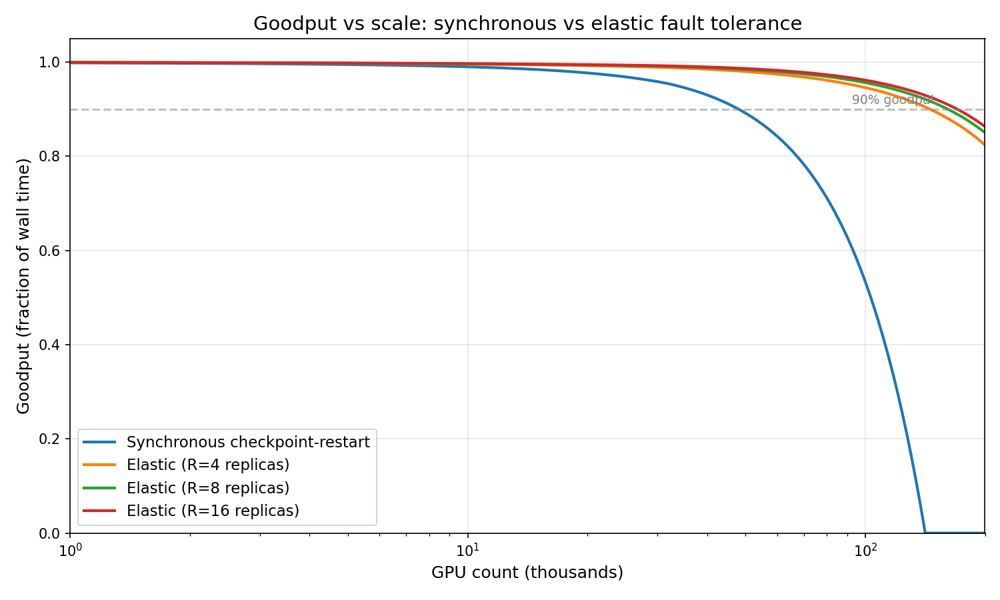

# Fault tolerance at scale


## 1. Introducing Goodput

When you're spending millions of dollars on a training run, the question isn't just "how fast
are my GPUs" -- it's "how much of that speed actually turns into trained model." The gap
between theoretical peak and realized progress is where "goodput"" lives.

Google published a useful decomposition of [goodput](https://cloud.google.com/blog/products/ai-machine-learning/goodput-metric-as-measure-of-ml-productivity):

  ML Productivity Goodput = Scheduling goodput × Program goodput x Runtime goodput

**Scheduling goodput** is the fraction of time that all resources required to run the training
job are available. This is controlled by your platform -- whether on-prem or cloud, how your
job scheduler works, how long you wait in queue. Important, but not what we're focusing on.

**Program goodput** is the fraction of hardware peak performance the training program can
extract. This is what we typically measure as MFU (Model FLOPs Utilization) in LLM
pre-training. Also important, also not the focus here.

**Runtime goodput** is the fraction of time spent making forward progress when all training
resources are available. This is where failures, recovery, checkpointing overhead, and
stragglers live. At 100K GPUs, Meta reports a failure every 18 minutes. If recovery takes
10 minutes, you're training less than half the time. That's a runtime goodput problem.

This entry focuses on runtime goodput: what breaks, how you detect it, how you recover
from it, and how the industry's approaches compare.


## 2. Why failures are inevitable

### What steady state looks like

A distributed training job in steady state is a repeating cycle: train for some
number of steps, checkpoint, maybe evaluate, repeat. Here's the timeline:

    ──────────────────── time ───────────────────────────────────►

    ┌─────┐┌─────┐┌─────┐┌─────┐┌─────┐┌──┐┌─────┐┌─────┐┌─────┐┌─────┐┌──┐
    │step1││step2││step3││step4││step5││CK││step6││step7││step8││step9││CK│ ...
    └─────┘└─────┘└─────┘└─────┘└─────┘└──┘└─────┘└─────┘└─────┘└─────┘└──┘
                                        ▲                                ▲
                                    checkpoint                      checkpoint

Each step is: load batch → forward → backward → apply gradients. Each checkpoint
is a snapshot of model + optimizer state to persistent storage (or memory). The
checkpoint interval determines how much work you can lose.

When a failure hits, everything between the last checkpoint and the failure is
wasted. The worst case is a failure right before a checkpoint -- you lose an
entire interval's worth of compute:

    ┌─────┐┌─────┐┌─────┐┌─────┐┌─────╳        ← failure at step 5
    │step1││step2││step3││step4││step5│💥
    └─────┘└─────┘└─────┘└─────┘└─────┘
                                  ▲
                            all 5 steps wasted
                            (must reload last checkpoint and redo)

    ┌──────────────── recovery ────────────────┐┌─────┐┌─────┐ ...
    │  alloc machines │ NCCL init │ load ckpt  ││step1││step2│
    └──────────────────────────────────────────┘└─────┘└─────┘
                    ▲
              this gets worse with scale

### The probabilistic argument

Individual server failures are rare. But probability compounds. If a single
server has a daily failure rate of p, then for N servers the probability of
*at least one* failure per day is:

    P(≥1 failure) = 1 - (1 - p)^N

Meta [measured](https://arxiv.org/pdf/2602.00277) 2.3 interruptions per 1,000
servers per day at 32K GPUs, giving p = 0.0023 per server per day. Assuming
independence, the expected number of failures per day is just p × N:

    N = 4,000 servers (32K GPUs):    ~9.2 failures/day   → MTBF ≈ 2.6 hours
    N = 12,500 servers (100K GPUs):  ~28.8 failures/day  → MTBF ≈ 50 minutes

But Meta reports an actual MTBF of 18 minutes at 100K GPUs -- nearly 3x worse
than linear extrapolation predicts. Failures don't scale linearly. At larger
clusters you hit correlated failure modes that independent-server models miss:
cross-datacenter network equipment, shared power domains, coordinated firmware
updates, and cascade failures where one node's timeout triggers NCCL timeouts
across the job.

Recovery time also scales unfavorably. Meta's [measured](https://arxiv.org/pdf/2602.00277) 
synchronous recovery time across scales (Figure 2):

    Scale        Cold recovery    NCCL init alone
    ─────        ─────────────    ───────────────
    16K GPUs       ~200s              17s
    22K GPUs       ~300s              ~30s
    64K GPUs       ~600s             ~100s
    98K GPUs       ~900s             ~200s

NCCL initialization -- where every GPU establishes connections with its peers --
grows 12x for a 6x increase in GPU count. Cold recovery at 98K takes 15
minutes; warm recovery (i.e. with pre-allocated machines) still takes ~10 minutes.
Meta's [NCCLX paper](https://arxiv.org/pdf/2510.20171) reports **11x faster
startup** at 96K GPUs vs baseline NCCL, through lazy connection establishment,
replacing the centralized bootstrap with async peer discovery, and reducing
algorithm complexity from O(N^2) to O(N). Even with these improvements, both
sides of the goodput equation get worse with scale: failures become more
frequent *and* recovery takes longer.

### What actually breaks

Meta's [FT-HSDP paper](https://arxiv.org/pdf/2602.00277) classified 678 unexpected
interruptions during production training at 32K H100 GPUs. The distribution is
worth internalizing:

    GPU HBM3 Memory ████████████████████████  22.9%
    PCIe Device     ██████████████████        18.0%
    NCCL Timeouts   █████████                  9.0%
    Faulty GPU      ███████                    7.4%
    Software Bug    ███████                    7.1%
    Host Maint.     ██████                     6.2%
    Kernel Fault    █████                      5.8%
    System Reboot   █████                      5.6%
    SDC             █████                      5.5%
    Network         █████                      5.3%
    other           ████                       7.2%

Hardware dominates (~78% of interruptions), but the long tail matters: software
bugs, NCCL timeouts, and silent data corruption are each significant on their
own. And SDC is arguably the most dangerous because it corrupts training
*silently* -- more on this in section 3.

ByteDance reported a broader view: 55,366 incidents across 778,135 training jobs
over three months. CUDA errors alone accounted for 36.1%. Job hangs (9.9%)
are the dominant *implicit* failure -- no error message, just silence.

For historical perspective, Meta's OPT-175B [logbook
](https://github.com/facebookresearch/metaseq/blob/main/projects/OPT/chronicles/OPT175B_Logbook.pdf)
documented 35 manual restarts and over 100 hosts cycled during a 2-month
training run on just 992 A100 GPUs. At that scale, "a couple of machines going
down every day" was normal. At 100x that scale, it's continuous.

### The punchline

At 98K GPUs with synchronous checkpoint-restart:

    MTBF                = 18 minutes
    Warm recovery time  = ~10 minutes (allocation + NCCL init ~200s + load + first step)
    Cold recovery time  = ~15 minutes
    Effective training  = (18 - 10) / 18 = 44%

You spend more time recovering than training. This is the problem that
[FT-HSDP](https://arxiv.org/pdf/2602.00277) (Meta),
[ByteRobust](https://arxiv.org/pdf/2509.16293) (ByteDance),
and [Pathways](https://arxiv.org/pdf/2203.12533) (Google) were each built to solve. Their answers differ
significantly -- elastic data parallelism, orchestration-level recovery, and
single-controller architectures -- but they all start from this same arithmetic.
The rest of this entry compares them.

(See Appendix B for a more complete survey of publicly reported failure rates.)


## 3. Detection: how do you know something broke?

Your recovery strategy doesn't matter if you can't detect the failure. Detection
time directly eats into goodput -- every minute spent figuring out that
something is wrong is a minute the entire cluster is stalled or, worse,
training on garbage.

You'll see a lot of emphasis on the communications layer in this section. Most
failures -- GPU errors, kernel panics, OOMs -- ultimately surface as NCCL
timeouts, because NCCL's synchronous collectives mean any single-rank failure
causes every other rank to block. The comms layer is the universal symptom
surface, which is why so much detection infrastructure lives there. The
challenge is working backwards from "NCCL timeout" to the actual root cause.

Failures come in three flavors, ordered by increasing difficulty: explicit (the
hardware tells you), implicit (silence), and silent data corruption (the
hardware lies to you).

### Explicit failures

A GPU throws a CUDA error, a NIC goes down, a host kernel panics -- somewhere
in the stack, an error code exists. These are "explicit" in the sense that the
hardware knows something is wrong. But here's the problem: the vanilla PyTorch
training loop doesn't see any of this. Your Python code calls
`dist.all_reduce()`, which calls into NCCL, which talks to the GPU driver, which
talks to the hardware. If a NIC dies, the driver knows. NCCL might eventually
notice. But your Python process will block, waiting for a collective that
will never complete, until the NCCL timeout fires 10 minutes later.

This is the gap that solutions like Meta's NCCLX and ByteRobust fill: building observers whose
job is to surface hardware-level errors to the training layer *before* they
manifest as a generic NCCL timeout.

NCCLX does this from inside the communication library (open-sourced as
[torchcomms](https://github.com/meta-pytorch/torchcomms)). Every collective
operation gets CUDA events recorded before and after it. A background watchdog
thread
[polls these events](https://github.com/meta-pytorch/torchcomms/blob/3d41b174166a/comms/torchcomms/ncclx/TorchWorkNCCLX.cpp#L175)
every 100ms:

```cpp
TorchWorkNCCLX::WorkStatus TorchWorkNCCLX::checkStatus() {
    cudaError_t end_status = comm_->getCudaApi()->eventQuery(end_event_);
    if (end_status == cudaSuccess) {
        setStatus(WorkStatus::COMPLETED);
    } else if (end_status != cudaErrorNotReady) {
        setStatus(WorkStatus::ERROR);   // CUDA error -- explicit failure
    }
    return status();
}
```

Second, the watchdog
[queries `ncclCommGetAsyncError()`](https://github.com/meta-pytorch/torchcomms/blob/3d41b174166a/comms/torchcomms/ncclx/TorchCommNCCLXUtils.cpp#L262)
every iteration to catch NCCL-internal and network transport errors (bad NICs,
RDMA failures) that don't surface through CUDA events:

```cpp
ncclResult_t asyncErr;
nccl_api_->commGetAsyncError(nccl_comm_, &asyncErr);
if (asyncErr != ncclSuccess) {
    comm_state_ = CommState::ERROR;
    abort();
}
```

ByteRobust takes a different approach -- active inspection rather than passive
waiting. A **Robust Agent** daemon runs in each training pod, continuously
monitoring hardware state through three channels: CUDA/RDMA/host events,
stdout/stderr logs with exit codes, and workload metrics (loss, gradient norm,
MFU). When the agent detects something wrong -- a NIC reporting errors, a GPU
driver not responding, an OS kernel fault -- it reports to the central Runtime
Analyzer immediately, before the failure has a chance to propagate to an NCCL
timeout.

The difference in detection time is dramatic (ByteRobust Table 3):

    Failure type      With inspection    Without (NCCL timeout)
    ────────────      ───────────────    ──────────────────────
    NIC crash              30s                ~10 min
    Port flapping          30s                ~10 min
    Switch down            60s                ~10 min
    Driver hang            10s                ~10 min
    GPU lost               10s                ~10 min
    OS kernel fault         2s                ~10 min

Without active inspection, all of these look the same: an NCCL timeout after
10 minutes. With it, you know what broke and where within seconds.

Notice that the line between "explicit" and "implicit" isn't really a property
of the failure -- it's a property of your observation layer. A NIC crash is
explicit at the driver level, but without an observer to surface it, it looks
implicit at the Python level: training just hangs, no error, silence until
timeout. ByteRobust documents a case where a communication hang was ultimately
caused by a CUDA error on a single GPU -- an explicit failure -- but manual
diagnosis took over 1.5 hours because the symptom (NCCL timeout across the
group) bore no obvious connection to the cause. Active inspection doesn't just
*speed up* detection of explicit failures -- it *reclassifies* them. Without
the Robust Agent, all those NIC crashes, driver hangs, and GPU-lost events in
the table above would show up as "job hangs" instead.

### Implicit failures (hangs and stragglers)

ByteDance reports that job hangs account for 9.9% of all incidents, making them
the dominant implicit failure mode. This is meaningful precisely because it's
the residual after active inspection has already caught the failures with
identifiable hardware signatures. Without their agents, the implicit failure
rate would be much higher.

What's left are the genuinely hard cases: failures where no component is
reporting an error. 

The [NCCLX paper](https://arxiv.org/pdf/2510.20171) gives
a concrete example, noting that NVLink failures "often manifest as stalled
load/store operations within CUDA kernels without returning a clear error
code." For more color, NVLink is the high-bandwidth interconnect between
GPUs on the same node. It exposes a shared memory address space -- when NCCL
sends data over NVLink, CUDA kernels just execute regular load/store
instructions targeting another GPU's memory. If the NVLink connection degrades
or faults, those instructions don't fail with an error. They just stall. The
GPU is sitting there with a pending memory operation that will never complete,
but from its perspective it's not an error -- it's just a very slow memory
access. No exception, no error code, no signal. This is the defining
characteristic of an implicit failure: something is broken but nothing is
telling you.

**Stragglers** are subtler still. No rank has failed, but one is slower than
the rest. In a synchronous collective, the slowest rank determines the speed
of the entire group -- one straggler reduces effective throughput for thousands
of GPUs without any single component being "broken." The FT-HSDP paper
documents one form: at 98K GPUs, a failure event causes a sudden change in
cluster power draw, which triggers a **power smoother** that throttles the
entire job for ~45 seconds -- infrastructure designed to protect the datacenter
from power transients inadvertently becoming a straggler. ByteRobust describes
a broader pattern where MFU declines but "all machines slow down
simultaneously, and the throughputs of IO and RDMA all decline at the same
time" -- making it hard to identify any single culprit.

Since there's no error to catch, the approach to implicit failures is:
instrument everything, measure everything, find outliers. Two strategies emerge.

NCCLX instruments at the collective level with
[**CollTrace**](https://github.com/meta-pytorch/torchcomms/blob/3d41b174166a/comms/ncclx/v2_28/meta/colltrace/CollTrace.cc#L334),
a per-communicator tracing system that runs a dedicated worker thread recording
the start and end of every collective:

```cpp
void* CollTrace::collTraceThreadFn(int cudaDev) {
    while (true) {
        curCollState_ = CurrentCollState::PENDING;
        curEvent_ = eventQueue_.waitPop();       // block until next collective

        curCollState_ = CurrentCollState::WAIT_START;
        curEvent_->start->waitEventFinishAndExecute(reportFunc);

        curCollState_ = CurrentCollState::IN_PROGRESS;
        curEvent_->stop->waitEventFinishAndExecute(reportFunc);

        curCollState_ = CurrentCollState::DONE;
        recordCurCollResult(latency);
    }
}
```

While waiting on events, `afterEachEventPoll` fires periodically to report
stalled collectives. A
[`SlowCollReporter`](https://github.com/meta-pytorch/torchcomms/blob/3d41b174166a/comms/ncclx/v2_28/meta/colltrace/CollTrace.cc#L88)
flags outliers when latency exceeds a per-process-group threshold, reporting
both slow completions and unfinished collectives. This gives you per-rank
visibility: which rank is slow, and in which collective.

But per-rank visibility isn't enough -- you need to correlate across ranks to
understand *what's actually stuck*. NCCLX's external **Analyzer service** does
this: it queries every rank's state and classifies the overall job health into
one of
[24 verdict types](https://github.com/meta-pytorch/torchcomms/blob/3d41b174166a/comms/analyzer/if/NCCLAnalyzerVerdict.thrift#L41)
-- `JOB_STUCK_IN_NCCL_WITH_INACTIVE_RANKS`, `NETWORK_PERF_SLOWNESS`,
`CHECKSUM_MISMATCH`, `JOB_CONTAINS_COLL_DEADLOCK`, etc. Each broken rank gets
its own classification too (`STUCK_INSIDE_NCCL`, `STUCK_OUTSIDE_NCCL`,
`FLAKY_OR_SLOW_CONNECTION_VIA_HTTP`, and 11 others). The Analyzer correlates
across ranks using multiple heuristics to localize the faulty rank. The key
idea: no single measurement tells you what's wrong, but the pattern across
thousands of ranks does.

ByteRobust applies the same outlier-detection idea, but at the process level:
**stack-trace clustering**. When a job hangs, collect stack traces from all
processes and group them by similarity. In a healthy collective, every rank
should be stuck in roughly the same place -- say, inside `ncclAllReduce`,
waiting for peers. If 7,999 processes are in `ncclAllReduce` but 1 is in
`cudaMalloc`, that outlier is probably the root cause. Then **over-evict** --
remove the entire smallest parallel group (e.g., TP group, PP stage) containing
the outlier rather than spending hours on precise diagnosis while the rest of
the cluster sits idle.

### Silent data corruption (SDC)

The hardest problem. The hardware computes a wrong answer and reports success.
No error, no hang, no signal -- just slightly wrong gradients propagating
through your model.

Why does this happen? It's genuinely faulty hardware -- transistor-level
defects that pass manufacturing tests but produce incorrect results under
specific conditions. At the scale of modern accelerators (billions of
transistors per chip, tens of thousands of chips per job), some fraction will
have marginal cells that flip bits during computation. These aren't random
cosmic-ray bit flips -- they're persistent defects in specific chips that
produce wrong results reproducibly for certain input patterns. This is why the
FT-HSDP data shows 37 SDC incidents traced to just 7 hosts: the same bad
hardware keeps corrupting.

At Google's scale, SDC events occurred every 1-2 weeks during Gemini 1.0
training. In Meta's data, SDC accounted for 5.5% of all interruptions. One
case: 32 consecutive parameters (out of 2 trillion total) in a single MoE
expert spiked by over 1e7. Root-cause investigations lasted hours to days.

SDC is where the approaches diverge most sharply.

**Google: deterministic replay + XSC**

Google's approach, described in the Gemini 2.5 paper, is the most sophisticated.
The key insight is that JAX + XLA on TPUs can provide **deterministic execution**:
the same inputs produce bit-identical outputs across runs. This makes SDC
detectable by simply re-running a step and comparing results.

The workflow:
1. A step produces suspicious metrics (loss spike, gradient norm anomaly)
2. The system replays the step with identical inputs (enabled by deterministic
   data ordering and checkpoint state)
3. During replay, per-device intermediate checksums are computed and compared
4. If checksums diverge, the divergence localizes the faulty device
5. The faulty device is excluded from the job

During Gemini 2.5 training, ~0.25% of steps were replayed due to suspected SDC.
Of those, 6% turned out to be genuine hardware corruption -- the rest were
false positives from non-determinism or transient issues.

The open-source implementation in axlearn reveals how this works at the compiler
level. [XSC (XLA SDC Checker)](https://github.com/apple/axlearn/blob/5602a78f9ccd/axlearn/common/compiler_options.py#L349)
is enabled via compiler flags. XSC's documentation isn't public, but the axlearn
authors' source comments describe the mechanism: on single-core TPUs (v5e, v6e),
the flag `xla_tpu_sdc_replicate_llo` duplicates Low-Level Operations so the
same computation runs twice on the same core and results are compared. On
dual-core TPUs (v4, v5p), `xla_tpu_sdc_checker_alternate_megacore_cores` alternates
between cores across re-runs, validating each core's output against the other:

```python
def infer_xsc_compiler_options(
    *, halt_on_detection: bool = True,
    repeat_count: int = 1,
    device_kind: str,
) -> dict:
    return dict(
        xla_tpu_enable_sdc_checker=True,
        xla_tpu_sdc_check_repeat_count=repeat_count,
        xla_tpu_sdc_check_halt_on_detection=halt_on_detection,
        # Duplicate LLO sequences for single-core-per-chip devices
        xla_tpu_sdc_replicate_llo=device_kind
            in ["TPU v5e", "TPU v5 lite", "TPU v6e", "TPU v6 lite"],
        # Alternate primary/secondary core across re-runs on dual-core devices
        xla_tpu_sdc_checker_alternate_megacore_cores=True,
        # ...
    )
```

The trainer integrates XSC via a
[policy system](https://github.com/apple/axlearn/blob/5602a78f9ccd/axlearn/common/trainer.py#L1124)
-- a callable that decides per-step whether to enable the checker:

```python
run_with_xsc = self._xsc_check_policy and self._xsc_check_policy(self.step)
compiled_train_step_fn = self._get_compiled_train_step_fn(
    trainer_state=self.trainer_state,
    input_batch=input_batch,
    with_xsc=run_with_xsc,
)
```

When XSC is enabled, the trainer compiles a **separate, uncached version** of
the train step with the XSC flags merged in. This is a different XLA program
from the normal train step.

There's an interesting gap between what the Gemini papers describe and what's in
the open-source code. The papers describe a full workflow: suspicious metrics
trigger replay, per-device checksums localize the fault, the faulty device is
excluded. axlearn implements the XSC compiler integration and the policy hook,
but the "suspicious metric triggers replay" logic and the device-level fault
localization live in Pathways -- the single-controller runtime that orchestrates
the full detection-replay-localize-exclude pipeline. The open-source layer just
says "run XSC at these steps" and "halt if corruption detected."

**Meta: allreduce checksums**

Meta's approach is simpler and targets a narrower class of SDC: corruption
that shows up in the cross-replica gradient exchange. The infrastructure lives
in NCCLX's [CTran transport layer](https://github.com/meta-pytorch/torchcomms/blob/3d41b174166a/comms/ctran/gpe/CtranChecksum.h),
which attaches checksums to collective communication operations. A
[`ChecksumPool`](https://github.com/meta-pytorch/torchcomms/blob/3d41b174166a/comms/ctran/gpe/CtranGpeImpl.h)
manages checksum state, and each collective's trace event carries a
`ChecksumItem` that records the checksum for post-hoc comparison. The
Analyzer's `CHECKSUM_MISMATCH` verdict type triggers when checksums diverge
across ranks participating in the same collective.

By checksumming allreduce inputs and outputs across replicas, they can detect
cases where one replica's gradients diverge from the others. This doesn't
catch corruption that's identical across replicas (e.g., a systematic defect
in a shared code path), but it's cheap and catches the common case of a single
faulty GPU producing garbage gradients.

**ByteDance: dual-phase group testing**

ByteDance's approach is the most methodical for **localization**. When SDC is
suspected, they run a two-phase replay test:
1. **Phase 1 (group testing):** Partition machines into groups along each
   parallelism dimension. Replay the step within each group. Identify which
   groups produce mismatches.
2. **Phase 2 (isolation):** The intersection of failing groups across
   dimensions uniquely identifies the single corrupted machine.

This is dimension-aware group testing -- it exploits the multi-dimensional
parallelism topology (DP × TP × PP) to localize a fault in just 2 rounds of
replay, regardless of cluster size. Elegant, but requires the infrastructure to
replay arbitrary subsets of the computation.

**Putting it together: the escalation ladder**

Each of these approaches addresses a different piece of the SDC problem. A
complete production pipeline chains them into an escalation ladder:

    step N completes
         │
         ▼
    ┌─────────────┐    no spike
    │ 1. DETECT   │───────────────────────────────────► continue training
    │ loss/gnorm  │                                     (99.75% of steps)
    │ vs baseline │
    └─────┬───────┘
          │ spike detected
          ▼
    ┌─────────────┐    replay matches
    │ 2. CONFIRM  │───────────────────────────────────► real spike, not SDC
    │ replay step │                                     (94% of replays)
    │ compare     │
    └─────┬───────┘
          │ mismatch (non-determinism)
          ▼
    ┌─────────────┐    checksums match
    │ 3. LOCALIZE │───────────────────────────────────► transient, schedule
    │ checksummed │                                     burn-in monitoring
    │ replay      │
    └─────┬───────┘
          │ checksum mismatch on rank R
          ▼
    ┌─────────────┐
    │ 4. REMOVE   │───────────────────────────────────► swap in standby,
    │ evict node  │                                     restart from ckpt,
    │ burn-in new │                                     burn-in new hardware
    └─────────────┘

1. **Detect**: Monitor loss and gradient norm against a rolling window baseline.
   A spike is a value exceeding some threshold (e.g., 1.4x baseline for loss,
   2.0x for grad norm) that is also a local high relative to recent history.
   The baseline needs to resist previous spikes inflating it -- combining the
   window median with a recent-half mean works well.

2. **Confirm**: When a spike fires, replay the step. If the replay produces
   the same loss and grad norm, the spike is real (bad data, training dynamics)
   -- not SDC. If the replay produces *different* values, you have
   non-determinism, which means either a hardware fault or a software bug.

3. **Localize**: Escalate to checksummed replay. Attach checksums to collective
   communication inputs and outputs, replay the step again. A checksum mismatch
   on a specific collective's inputs uniquely identifies the node that produced
   corrupted data. This is more expensive than a plain replay but gives you a
   machine to blame. If checksums *match* despite the level-2 mismatch, the
   corruption was likely transient -- but you can't be sure. Schedule **burn-in
   monitoring**: run the next N steps with checksums enabled (the expensive mode)
   rather than waiting for another spike to trigger re-escalation. If the
   hardware is genuinely bad, it'll likely corrupt again during this window and
   you'll catch it with checksums already on.

4. **Remove**: Flag the faulty node for removal. The orchestration layer swaps
   in a standby, the job restarts from the last checkpoint, and burn-in replays
   run on subsequent steps to verify the replacement hardware is clean.

The key design insight is that each level is more expensive than the last, so
you only escalate when the cheaper check is inconclusive. Most steps never
trigger level 1. Most spikes are real and stop at level 2. Only genuine SDC
reaches levels 3 and 4.

### What detection costs you

Detection time is pure waste. The naive approach -- wait for a NCCL collective
timeout -- costs ~10 minutes per failure. ByteRobust's active inspection cuts
this to seconds. Google's XSC adds ~0% overhead when not triggered and replays
only 0.25% of steps. NCCLX's 100ms polling loop catches most explicit failures
within a watchdog iteration.

But there's a subtler cost: **false positives**. Google reports that 94% of
replayed steps were *not* genuine SDC. Each false positive replay wastes one
step's worth of compute across the entire cluster. The policy for when to
trigger replay -- too aggressive and you waste compute on false positives, too
conservative and corruption propagates through training -- is itself a goodput
optimization problem.


## 4. Recovery: three paradigms

The detection mechanisms in section 3 tell you something broke. Recovery is what
happens next. Three dimensions differentiate the approaches we'll examine:

**Failure unit**: what do you kill? Checkpoint-restart kills the entire job.
Elastic HSDP and Pathways both kill a single DP replica -- the key insight
being that DP replicas hold redundant copies of the model, so losing one costs
throughput but not state. (Google calls it a "TPU slice," but slices are DP
replicas -- model parallelism runs within a slice, data parallelism across
slices.) ByteRobust is different: it over-evicts the smallest parallel group
containing the faulty rank, which could be a TP group, a PP stage, or any
other non-redundant partition. This works because ByteRobust doesn't try to
continue elastically -- it stops the affected group, swaps in replacements
from a warm standby pool, and restarts from checkpoint.

**Recovery mechanism**: how do you get back to training? Reload everything from
persistent storage. Fetch a checkpoint peer-to-peer from a surviving replica.
Swap in a pre-validated standby machine and restart the affected subset. Reshard
computation across fewer devices.

**Where the logic lives**: in the training framework (torchft modifies how
allreduce and gradient accumulation work), in the orchestration layer
(ByteRobust's control plane manages recovery while the trainer stays simple),
or in the runtime (Pathways' single controller has a global view of all state
and can reconfigure everything centrally).

The comparison table at the end of this section summarizes the tradeoffs. What
follows is how each approach actually works.

### Checkpoint-restart (baseline)

The recovery timeline for synchronous checkpoint-restart is straightforward:

    allocate machines → NCCL init → load checkpoint → first step

Section 2 covered the numbers: cold recovery takes ~200s at 16K GPUs and ~900s
at 98K GPUs. Every component scales badly. NCCL initialization grows 12x for a
6x increase in GPU count. Machine allocation depends on cluster load. Checkpoint
loading depends on I/O bandwidth and model size. And the entire cluster sits
idle throughout.

At 98K GPUs with an MTBF of 18 minutes and warm recovery taking ~10 minutes,
you get 44% effective training time. This is the baseline that everything else
improves upon.

### Elastic HSDP (Meta)

The core insight behind Meta's [FT-HSDP](https://arxiv.org/pdf/2602.00277) is
that data-parallel replicas are redundant by construction. In a typical
large-scale training setup, the model is sharded across devices using tensor
parallelism (TP) and pipeline parallelism (PP), then this sharded unit is
replicated across data-parallel (DP) groups. Every DP replica holds an identical
copy of the model. If you lose a TP shard, the model is incomplete -- training
cannot continue. If you lose a PP stage, the pipeline is broken. But if you lose
a DP replica, you've lost throughput, not state. The remaining replicas still
hold the complete model and can continue training at reduced batch size.

This makes DP the natural fault domain for elastic training. When a failure is
detected in one replica, only that replica needs to recover. The others continue.

**The recovery timeline.** Compare elastic recovery to the baseline:

    Checkpoint-restart:
    ┌──────────── full cluster stall ──────────────┐
    │ alloc machines → NCCL init → load ckpt       │→ first step (all replicas)
    └──────────────────────────────────────────────┘
    Total: ~10 min at 98K GPUs

    Elastic HSDP:
    ┌─ stall ─┐┌── degraded (N-1)/N ───┐
    │ quorum  ││ healthy: train        │→ full speed
    │ + reconf││ recovering: fetch ckpt│
    └─────────┘└───────────────────────┘
    ~3 min stall + ~7 min degraded at 11/12 throughput + ~8 min full

FT-HSDP reports a stall of approximately 3 minutes, during which **all
replicas** -- including healthy ones -- are stopped. The stall breaks down as:
~60 seconds for the NCCL allreduce timeout to fire (healthy replicas are
blocked waiting for the dead one), followed by FTAR reconfiguration to exclude
the failed replica, then ~20 seconds to re-train the step that was in-flight
when the failure occurred. The paper found two bugs that inflated the stall
beyond the expected ~1.5 minutes: a power smoother adding ~45 seconds and an
unnecessary FTAR reconfiguration on healthy replicas adding another ~45
seconds. With fixes, the target stall is ~1.5 minutes.

After the stall, the system enters degraded operation at (N-1)/N throughput:
healthy replicas resume training while the recovering replica asynchronously
fetches a checkpoint and catches up. There is a secondary stall of ~100 seconds
when the recovering replica rejoins (a first-step effect from NCCL
initialization). At 100K GPUs with 12 DP replicas, the paper calculates 80%
effective training time -- nearly double the 44% from checkpoint-restart.

**Zero-gradient catch-up.** The recovering replica needs to synchronize with
the rest of the group. The mechanism is elegant: during the first step after
rejoining, the recovering replica participates in the allreduce but contributes
zero gradients. The gradient average is divided only by the number of
contributing replicas, so the result is mathematically identical to running a
step with N-1 replicas. Meanwhile, the recovering replica asynchronously fetches
a checkpoint from a healthy peer via HTTP. After one step, it has the checkpoint
loaded and is fully synchronized -- no approximations, no gradient staleness, no
impact on convergence.

**FTAR.** Meta's **F**ault-**T**olerant **A**ll**R**educe splits the responsibility between CPU
and GPU. The CPU drives the control plane: connection management, peer
discovery, congestion control, error classification. The GPU handles the data
plane via RDMA transfers. This separation lets FTAR match NCCL's bandwidth
using only 2 streaming multiprocessors versus NCCL's 4, because the CPU handles
all the coordination that NCCL's GPU kernels otherwise have to manage in-band.

**Quorum protocol.** Before each training step, all replicas agree on who is
alive and participating. This per-step consensus is the quorum protocol. The
naive implementation added 9 seconds of overhead at 100K GPU scale. FT-HSDP's
**FastQuorum** optimization reduces this to 700ms by overlapping quorum
computation with the training step -- the quorum for step N+1 runs concurrently
with the computation of step N.

**torchft architecture.** The open-source implementation,
[torchft](https://github.com/pytorch/torchft), realizes this as a three-tier
system:

    ┌───────────────────────────────────────────────────┐
    │                  Lighthouse (Rust)                │
    │              global quorum coordinator            │
    │         one instance for the entire job           │
    └───────────┬──────────────┬──────────────┬─────────┘
                │              │              │
    ┌───────────▼───┐  ┌───────▼───────┐  ┌────▼──────────┐
    │ Manager (Rust)│  │ Manager (Rust)│  │ Manager (Rust)│
    │ replica 0     │  │ replica 1     │  │ replica 2     │
    │ per-replica   │  │ per-replica   │  │ per-replica   │
    └──┬──────┬─────┘  └─┬──────┬──────┘  └─┬──────┬──────┘
       │      │          │      │           │      │
    ┌──▼─┐ ┌──▼─┐     ┌──▼─┐ ┌──▼─┐      ┌──▼─┐ ┌──▼─┐
    │ W0 │ │ W1 │     │ W0 │ │ W1 │      │ W0 │ │ W1 │
    │ Py │ │ Py │     │ Py │ │ Py │      │ Py │ │ Py │
    └────┘ └────┘     └────┘ └────┘      └────┘ └────┘
    ManagerClient      ManagerClient       ManagerClient
    + ProcessGroup     + ProcessGroup      + ProcessGroup

**Tier 1: Lighthouse.** A single Rust process that receives heartbeats and
quorum requests from all replicas. Its core decision logic lives in
[`quorum_compute()`](https://github.com/pytorch/torchft/blob/390aed474e209de6a17a20dd59827edc0190bd12/src/lighthouse.rs#L141):

```rust
fn quorum_compute(
    now: Instant, state: &State, opt: &LighthouseOpt,
) -> (Option<Vec<QuorumMember>>, String) {
    // 1. Filter to healthy replicas via heartbeat timeout
    let healthy_replicas: HashSet<&String> = heartbeats.iter()
        .filter_map(|(replica_id, last_heartbeat)| {
            if now.duration_since(*last_heartbeat)
                < Duration::from_millis(opt.heartbeat_timeout_ms)
            { Some(replica_id) } else { None }
        }).collect();

    // 2. Fast path: if all previous quorum members are still healthy, reuse
    if is_fast_quorum {
        return (Some(candidate_participants), "Fast quorum found!");
    }

    // 3. Split-brain prevention: require >50% of heartbeating workers
    if healthy_participants.len() <= healthy_replicas.len() / 2 {
        return (None, "not enough participants for majority");
    }

    // 4. Wait for stragglers up to join_timeout_ms before issuing quorum
    if !all_healthy_joined
        && now.duration_since(first_joined) < Duration::from_millis(opt.join_timeout_ms)
    {
        return (None, "waiting for stragglers...");
    }

    (Some(candidate_participants), "Valid quorum found")
}
```

This is a pure function called on a tick. The decision hierarchy is: filter dead
replicas via heartbeats, fast-path if the previous quorum is intact, check
minimum replicas, prevent split-brain with majority rule, then wait for
stragglers up to a timeout. The FastQuorum optimization is the fast path at
step 2 -- if nothing has changed since the last quorum, skip the waiting period
entirely. Each replica's
[`quorum()` RPC](https://github.com/pytorch/torchft/blob/390aed474e209de6a17a20dd59827edc0190bd12/src/lighthouse.rs#L483)
blocks until the Lighthouse produces a quorum that includes it. If a quorum
forms but excludes this replica (e.g., because it requested `shrink_only`), the
replica re-inserts itself and waits for the next round.

**Tier 2: Manager.** One Rust process per replica group, running on rank 0. It
serves as a barrier: all workers within the replica call the Manager's
[`quorum()`](https://github.com/pytorch/torchft/blob/390aed474e209de6a17a20dd59827edc0190bd12/src/manager.rs#L332)
RPC, and only when all `world_size` workers have reported in does it make a
single call to the Lighthouse on behalf of the entire replica. Once the
Lighthouse returns a quorum, the Manager runs
[`compute_quorum_results()`](https://github.com/pytorch/torchft/blob/390aed474e209de6a17a20dd59827edc0190bd12/src/manager.rs#L489)
to compute recovery assignments:

```rust
fn compute_quorum_results(
    replica_id: &str, group_rank: i64,
    quorum: &Quorum, init_sync: bool,
) -> Result<ManagerQuorumResponse, Status> {
    // Sort participants by replica_id for deterministic rank assignment
    participants.sort_by(|a, b| a.replica_id.cmp(&b.replica_id));

    // Replicas behind the max step need recovery
    let max_step = participants.iter().map(|p| p.step).max().unwrap();
    let recovering: Vec<usize> = participants.iter().enumerate()
        .filter_map(|(i, p)| {
            if p.step != max_step { Some(i) } else { None }
        }).collect();

    // Round-robin: distribute recovering nodes across up-to-date ones
    for (i, recovering_rank) in recovering.iter().enumerate() {
        let src_idx = (i + group_rank as usize) % up_to_date_ranks.len();
        recovery_assignments.entry(src_idx).or_default().push(*recovering_rank);
    }

    Ok(ManagerQuorumResponse {
        heal: recover_src_replica_rank.is_some(),
        recover_src_manager_address, recover_dst_replica_ranks,
        max_step, replica_rank, replica_world_size, ...
    })
}
```

Replicas that are behind the maximum step are assigned to recover from
up-to-date replicas via round-robin distribution, offset by `group_rank` to
balance load across workers within a replica. The Manager also implements a
two-phase commit via
[`should_commit()`](https://github.com/pytorch/torchft/blob/390aed474e209de6a17a20dd59827edc0190bd12/src/manager.rs#L423):
at the end of each step, every worker votes on whether to commit. If any worker
encountered an error (e.g., a failed NCCL collective), the entire replica
rejects the step. This prevents partial updates from corrupting model state --
the step either commits on all workers or rolls back on all of them.

**Tier 3: ProcessGroup.** The training-loop-facing component. The key innovation
here is
[`ProcessGroupBaby`](https://github.com/pytorch/torchft/blob/390aed474e209de6a17a20dd59827edc0190bd12/torchft/process_group.py#L1445),
which runs NCCL in a subprocess:

```python
class ProcessGroupBaby(ProcessGroup):
    """Runs the underlying process group in a subprocess. Since it's running
    in a subprocess all tensors need to be in shared memory. CUDA tensors are
    implicitly shareable and don't need any changes."""

    def configure(self, store_addr, replica_id, rank, world_size, ...):
        self.shutdown()  # kill previous subprocess
        ctx = mp.get_context("spawn")
        self._p = ctx.Process(
            target=self._worker,
            args=(store_addr, rank, world_size, ...),
            daemon=True,
        )
        self._p.start()
```

Why a subprocess? Because `ncclCommDestroy` is unreliable -- it can deadlock or
crash the process. When a failure occurs and the process group needs to be
reconfigured, torchft kills the entire subprocess and spawns a fresh one. The
[`ProcessGroupBabyNCCL`](https://github.com/pytorch/torchft/blob/390aed474e209de6a17a20dd59827edc0190bd12/torchft/process_group.py#L2042)
subclass instantiates the NCCL backend in the child process. The tradeoff is
~1GB of extra memory for the separate CUDA context, and potentially reduced GPU
utilization due to time-sharing between the main and subprocess CUDA contexts
(separate CUDA contexts cannot execute kernels simultaneously on the same GPU).

With NCCL >= 2.25, torchft also offers an in-process
[`ProcessGroupNCCL`](https://github.com/pytorch/torchft/blob/390aed474e209de6a17a20dd59827edc0190bd12/torchft/process_group.py#L780)
that uses `ncclCommAbort` for clean teardown, avoiding the subprocess overhead
entirely.

The Python
[`Manager`](https://github.com/pytorch/torchft/blob/390aed474e209de6a17a20dd59827edc0190bd12/torchft/manager.py#L148)
ties it all together. On rank 0 of each replica, it starts the Rust
ManagerServer. All ranks discover the Manager's address through PyTorch's
`TCPStore`. The
[`_async_quorum()`](https://github.com/pytorch/torchft/blob/390aed474e209de6a17a20dd59827edc0190bd12/torchft/manager.py#L630)
method handles the full recovery flow: request quorum from the Rust Manager,
reconfigure the ProcessGroup if membership changed, send or receive checkpoints
as directed by the recovery assignments, then load state if healing:

```python
def _async_quorum(self, allow_heal, shrink_only, quorum_timeout, curr_device):
    quorum = self._client._quorum(
        group_rank=self._group_rank, step=self._step,
        checkpoint_metadata=self._checkpoint_transport.metadata(),
        shrink_only=shrink_only, timeout=quorum_timeout,
        init_sync=self._init_sync, commit_failures=self._commit_failures,
    )

    if quorum_id != self._quorum_id:
        # Reconfigure ProcessGroup with new membership
        self._pg.configure(store_addr, self._replica_id,
                           replica_rank, replica_world_size, quorum_id, ...)

    if quorum.recover_dst_replica_ranks:
        # This replica is healthy -- send checkpoint to recovering peers
        self._checkpoint_transport.send_checkpoint(
            dst_ranks=quorum.recover_dst_replica_ranks, ...)

    if heal:
        # This replica is recovering -- receive checkpoint from healthy peer
        self._pending_state_dict = self._checkpoint_transport.recv_checkpoint(
            src_rank=recover_src_replica_rank, ...)
        self.load_state_dict(self._pending_state_dict["torchft"])
```

This quorum computation runs in a background thread so it can overlap with the
forward pass -- the async quorum is kicked off at the start of each step via
[`start_quorum()`](https://github.com/pytorch/torchft/blob/390aed474e209de6a17a20dd59827edc0190bd12/torchft/manager.py#L560),
and the result is consumed before the backward pass when gradients need to be
synchronized.

**Key numbers.** FT-HSDP reports zero steady-state overhead (no cost when
nothing is failing), approximately 3 minutes of full-cluster stall per failure
event (target ~1.5 minutes with bug fixes), and 80% effective training time at
100K GPUs -- compared to the 44% baseline.

### Orchestration-level (ByteDance / ByteRobust)

ByteDance's [ByteRobust](https://arxiv.org/pdf/2509.16293) takes the opposite
philosophy from elastic HSDP: keep the training framework simple, push fault
tolerance entirely into the cluster control plane. The training code doesn't
know about fault tolerance. It runs, it checkpoints, it crashes, and something
external puts it back together.

The "something external" is a two-layer control plane. The **Robust Controller**
and **Runtime Analyzer** form the central brain (~32,000 lines of Go), running
as cluster services. The **Robust Agent** is a Python daemon (~5,000 lines)
running in every training pod, continuously monitoring hardware state and
reporting to the controller. The division of labor: agents observe, the
controller decides, and the training framework just trains.

**Over-eviction.** When a failure is detected (see section 3's discussion of
stack-trace clustering), ByteRobust doesn't try to identify the exact faulty
GPU. Instead, it removes the entire smallest parallel group containing the
suspect -- the full TP group, PP stage, or DP replica. This trades precision
for speed: if exact diagnosis takes hours but over-eviction takes seconds, you
save more goodput by evicting quickly and dealing with the occasional false
positive.

**Warm standby pool.** Removed machines need replacements. ByteRobust maintains
a pool of pre-validated standby machines sized to cover the expected failure
count. The sizing logic: machine failures in large-scale training are
independent events with a measurable daily rate (estimated from historical
data). If you have N machines each failing independently with probability p,
the number of simultaneous failures follows a binomial distribution B(N, p).
ByteRobust sets the standby pool size to the 99th percentile (P99) of this
distribution -- so there's only a 1% chance of needing more standbys than are
available. The paper gives a concrete example: **4 backup machines for a
1,024-instance job.**

Each standby machine goes through pod environment initialization before
entering a low-power sleep mode: machine self-checks (the paper references
[SuperBench](https://github.com/microsoft/superbenchmark), a proactive GPU
validation suite, for their benchmarking infrastructure), container image
installation, and library downloading. The Robust Agent on each standby
machine sits at a pre-set barrier in a polling loop, periodically checking
the Robust Controller for an activation signal. When a failure triggers
eviction, standby machines are awakened and resume training past the barrier
-- no scheduling, no environment setup, no validation delay. If evictions
exceed the pool size, ByteRobust reschedules only the shortfall (not the
whole job) and waits for those machines to finish initialization.

The result: 10.87x faster recovery compared to requeuing through the cluster
scheduler, 5.36x faster than rescheduling only evicted machines, and within
5.19% of the oracle upper bound (unlimited standbys). The pool is replenished
asynchronously after each use.

**In-place hot-update.** During recovery, ByteRobust applies any pending code
updates lazily -- the replacement machine gets the latest code as part of the
restart process. This eliminates the need for separate requeue-based code
deployments, which are 11x slower because they tear down and rebuild the entire
job rather than replacing a single machine.

**Cross-parallel-group checkpoint backup.** Over-eviction means an entire
parallel group can disappear at once. If your checkpoint backup lives on a
machine in that same group, you lose both the primary and the backup. The fix is
straightforward: each rank backs up its checkpoint to a different DP replica.
Since TP and PP run within each DP replica, a machine in a different DP replica
automatically shares none of your parallel groups -- so a single over-eviction
event can never take out both your primary and your backup. Model states are
deduplicated within the DP group first (DP replicas hold identical copies), then
backed up the same way.

The backup runs every step with less than 0.9% MFU overhead. States are
partitioned into small chunks and transmitted during idle communication windows
(forward and backward passes), interleaved with training traffic. A separate
CUDA stream isolates checkpointing kernels from training, and a dual-buffer
design overlaps device-to-host copy, serialization, and cross-replica send
concurrently. Everything stays in host CPU memory and local SSD -- no remote
storage. This also eliminates a class of failures the paper observed: 1,104
HDFS errors over three months that would have caused training hangs or crashes.

**Control plane architecture.** The Robust Controller runs as a centralized
cluster service that makes recovery decisions: which machines to evict, which
standbys to assign, when to restart. The Runtime Analyzer processes telemetry
from all Robust Agents -- hardware metrics, training metrics (loss, gradient
norm, MFU), and the stack-trace clustering results from section 3 -- to classify
failures and recommend actions. The separation between the Go control plane and
Python data plane is deliberate: the control plane needs to survive training
crashes (it's a separate process), while the agents need deep integration with
the training runtime (access to CUDA state, stack traces, stdout/stderr).

**Key numbers.** Over a 3-month production period on 9,600 GPUs, ByteRobust
achieved 97% cumulative Effective Time To Recovery (ETTR) -- meaning 97% of
the time was spent productively training. The cross-parallel-group checkpoint
backup added less than 0.9% MFU overhead while enabling every-step
checkpointing.

### Single-controller (Google / Pathways)

Google's approach starts from a fundamentally different programming model. In
SPMD (Single Program, Multiple Data) -- the model used by PyTorch's distributed
training -- every rank runs the same program independently. Coordination happens
through explicit collective communication. If one rank fails, every other rank
is stuck waiting for a peer that will never respond.

In JAX's single-controller model, one Python process orchestrates the entire
training run. The [GSPMD partitioner](https://arxiv.org/pdf/2105.04663) in the
XLA compiler takes a program written for one device, automatically shards it
across thousands of devices, and inserts the necessary communication.
[Pathways](https://arxiv.org/pdf/2203.12533) is the runtime that executes these
sharded programs across TPU pods. The result: one process with a global view of
all state, making recovery a state management problem rather than a distributed
coordination problem.

**Slice-granularity elasticity.** When a TPU slice fails, Pathways drops it and
continues training with the remaining N-1 slices. This works for the same
reason elastic HSDP works: each slice is a DP replica. The
[Gemini 1.0 paper](https://arxiv.org/pdf/2312.11805) states this explicitly --
"model parallelism within superpods and data-parallelism across superpods."
TP and PP run inside each slice over the high-speed ICI interconnect; DP runs
across slices over the datacenter network. Losing a slice means losing a
redundant model copy, not a unique shard.

The [Gemini 2.5 paper](https://arxiv.org/pdf/2507.06261) reports that
reconfiguration takes tens of seconds (compared to 10+ minutes for
checkpoint-restart), and the system continues at approximately 97% throughput
while the failed slice recovers. At the scale of Gemini training runs, hardware
failures occur multiple times per hour, but the fault tolerance machinery is
designed to tolerate even higher failure rates.

**The Pathways elastic API.** The
[Pathways resilient training documentation](https://docs.cloud.google.com/ai-hypercomputer/docs/workloads/pathways-on-cloud/resilient-training)
and the open-source
[pathways-utils](https://github.com/AI-Hypercomputer/pathways-utils) package
show the programming model. The core recovery pattern is a try/except around
the train step:

```python
while step < final_step:
    try:
        state = jitted_train_step(state)
        elastic_manager.maybe_snapshot(step=step, snapshot=state)
        elastic_manager.maybe_reshard_up(step=step, snapshot=state,
            elastic_handler=elastic_handler, ...)
        step += 1
    except jax.errors.JaxRuntimeError as error:
        elastic_manager.maybe_reshard_down(error=error,
            elastic_handler=elastic_handler, ...)
```

The three API methods: `maybe_reshard_down` checks whether the
`JaxRuntimeError` was caused by a slice loss and calls the user's
`elastic_handler` to reinitialize with fewer slices. `maybe_reshard_up` polls
for recovered slices and reshards back up. `maybe_snapshot` periodically saves
state to pinned host memory so the handler has something to reinitialize from.
The user provides the elastic handler -- it reads `manager.good_devices` to
discover which slices survived, rebuilds the mesh, re-jits the train step, and
calls `manager.get_resharded_snapshot(new_mesh)` to move the saved state onto
the new device set. Resharding is always at slice granularity -- there is no
API parameter to specify which dimension shrinks. The handler rebuilds the mesh
with N-1 slices, and since multi-slice training lays out DP across slices
(TP/PP within each slice), losing a slice always means losing a DP replica.
The `maybe_reshard_down` call is just a retry loop around the handler; the
dimension question is settled by the hardware topology, not by user code.

The elastic handler itself is straightforward -- rebuild the mesh, re-jit, and
restore from the host-memory snapshot:

```python
def elastic_handler(elastic_utils, *args, **kwargs):
    # Rebuild mesh with surviving slices (N-1 instead of N)
    mesh = initialize_mesh(**kwargs["mesh_kwargs"])
    # Re-initialize and re-jit the train step for the new device count
    initial_state, initial_step, jitted_train_step, other_variables = \
        initialize_training_loop(mesh, **kwargs["initialize_training_loop_kwargs"])
    # Restore state from the most recent host-memory snapshot
    step, snapshot = elastic_utils.get_next_snapshot()
    state = initial_state.replace(**snapshot)
    return state, step, mesh, jitted_train_step, other_variables
```

This is regular single-process Python -- no distributed coordination, no
process group renegotiation. The handler has a global view of all state because
the single-controller model gives it one. Compare this to torchft's recovery
path, which requires a quorum protocol across all surviving replicas, a new
NCCL process group in a subprocess, and a coordinated zero-gradient step.

**What's actually inside.** The
[pathways-utils source](https://github.com/AI-Hypercomputer/pathways-utils)
(~300 lines of Python for the elastic module) reveals how thin this layer is.
Slice loss detection is string-matching on `JaxRuntimeError` messages --
checking for gRPC status codes like `DATA_LOSS`, `DEADLINE_EXCEEDED`, and
`INTERNAL` that leak through from the IFRT Proxy connection:

```python
_ELASTIC_DOWN_ERROR_TYPES = ["DATA_LOSS"]
_ELASTIC_DOWN_ADDITIONAL_ERROR_TYPES = ["DEADLINE_EXCEEDED", "NOT_FOUND", "INTERNAL"]

def is_error_due_to_slice_down(self, error):
    return any(error_type in str(error) for error_type in self._ELASTIC_DOWN_ERROR_TYPES + ...)
```

Availability probing runs `pmap(lambda x: x + 1)` on each slice independently
and catches the exception on `block_until_ready` -- dead slices fail this
trivial test. Snapshots are `jax.device_put` to pinned host memory.
Resharding is `jax.device_put` with a new `NamedSharding` on the new mesh.
`maybe_reshard_down` is a `while True` retry loop that keeps calling the
elastic handler until it succeeds or the error isn't slice-related.

All the real work -- detecting hardware failures, propagating them as gRPC
errors through the IFRT Proxy, re-establishing connections to surviving slices,
making the new device set available to JAX, coordinating OCS reconfiguration --
happens inside the Pathways runtime and the IFRT Proxy backend, neither of
which is open-source. The elastic manager is a thin retry loop on top of
standard JAX APIs. This is the key asymmetry with the other approaches we've
studied: for torchft, you can read the Lighthouse quorum protocol, the
ProcessGroupBaby subprocess isolation, the Manager's split-brain prevention
logic. For ByteRobust, the paper gives you the stack-trace clustering
algorithm, the dual-phase replay, the checkpoint scheduling. For Pathways, you
get the results (97% throughput, tens of seconds recovery, multiple failures per
hour) but not the mechanism. The engineering that makes those numbers possible
is behind Google's internal wall.

The contrast with torchft is still striking at the API level. torchft weaves
fault tolerance into the allreduce, the gradient accumulation, the process
group -- the distributed primitives themselves are fault-aware. Pathways' API is
just a try/except. The user's elastic handler is regular Python with a global
view of all state, not a distributed protocol across thousands of ranks. That
simplicity is what the Gemini 2.5 paper means by "relatively simple to
implement due to the single-controller design" -- but the simplicity comes from
pushing all the hard problems into the runtime.

**Redundant in-memory replicas.** For [Gemini 1.0](https://arxiv.org/pdf/2312.11805),
Google maintained redundant in-memory copies of model state. On failure,
recovery loaded directly from an intact replica rather than from persistent
storage, eliminating disk I/O entirely. This increased goodput from 85% (the
PaLM/PaLM-2 baseline with periodic checkpointing to storage) to 97%. The
combination of single-controller orchestration and in-memory replicas meant
that even at significantly larger training resources than PaLM, recovery time
decreased.

**Key numbers.** Approximately 97% throughput during recovery from slice loss.
Failures occur multiple times per hour at Gemini scale and are handled
transparently. Goodput improved from 85% to 97% with in-memory replicas
(Gemini 1.0 vs PaLM baselines). Pathways is Google-internal and
[still in Preview on GCP](https://docs.cloud.google.com/ai-hypercomputer/docs/workloads/pathways-on-cloud/pathways-intro).


### Orchestration-level FT on JAX (axlearn)

The open-source [axlearn](https://github.com/apple/axlearn) framework takes a
different approach from Pathways. Despite also targeting JAX on TPUs, axlearn
uses standard JAX multi-controller SPMD -- not Pathways' single-controller
model. Its fault tolerance is an orchestration-layer supervisor, architecturally
closer to ByteRobust than to Pathways: an agent-per-pod pattern with
checkpoint-restart recovery, running on GKE.

axlearn needs this independence because it supports multiple backends (GCP TPUs,
AWS GPUs, Trainium2) -- tying to Pathways would break cross-cloud portability.

**FT agent hierarchy.** Here "pod" means Kubernetes pod, not TPU pod slice.
Each TPU VM runs one K8s pod, and each pod runs one FT agent as its main
process. A TPU slice (e.g., a v4-128) contains multiple VMs/pods:

    GKE cluster
    ├─ TPU slice 0 (= DP replica 0)
    │  ├─ VM 0 / K8s pod 0 ─── FT Agent ─── Trainer (subprocess)
    │  │                        ├ replica_manager (worker_id == 0)
    │  │                        └ global_manager  (replica_id == 0, worker_id == 0)
    │  │                          ├ detects global hangs (600s no progress)
    │  │                          └ coordinates restarts across all replicas
    │  ├─ VM 1 / K8s pod 1 ─── FT Agent ─── Trainer
    │  ├─ VM 2 / K8s pod 2 ─── FT Agent ─── Trainer
    │  └─ VM 3 / K8s pod 3 ─── FT Agent ─── Trainer
    │
    ├─ TPU slice 1 (= DP replica 1)
    │  ├─ VM 0 / K8s pod 0 ─── FT Agent ─── Trainer
    │  │                        └ replica_manager (worker_id == 0)
    │  │                          └ aggregates worker status, reports to global mgr
    │  ├─ VM 1 / K8s pod 1 ─── FT Agent ─── Trainer
    │  ├─ VM 2 / K8s pod 2 ─── FT Agent ─── Trainer
    │  └─ VM 3 / K8s pod 3 ─── FT Agent ─── Trainer
    │
    └─ TPU slice 2 (= DP replica 2)
       └─ ... (same pattern)

    Communication flow:
    Workers ──status (step, TensorCore util)──▶ Replica Manager ──▶ Global Manager
    Global Manager ──restart request──▶ Replica Managers ──▶ Workers

The hierarchy is defined purely by position in the topology. Every pod runs the
same code; a
[`WorkerIdentity`](https://github.com/apple/axlearn/blob/5602a78f9ccd/axlearn/ft/utils.py#L44)
determines which role activates:

```python
@dataclass
class WorkerIdentity:
    hostname: str
    replica_id: int   # TPU slice index (from MEGASCALE_SLICE_ID)
    worker_id: int    # VM index within slice (from TPU_WORKER_ID)

    @property
    def is_replica_manager(self) -> bool:
        return self.worker_id == 0  # worker 0 in each slice

    @property
    def is_global_manager(self) -> bool:
        return self.replica_id == 0 and self.worker_id == 0  # one per job
```

Workers report status (training step, tensor core utilization) upward every 30
seconds. Replica managers aggregate per-slice status and forward to the global
manager, which detects training hangs (no progress for 600 seconds) and
coordinates restarts downward through the hierarchy.

**The agent-as-main-process pattern.** The
[FT agent](https://github.com/apple/axlearn/blob/5602a78f9ccd/axlearn/ft/agent.py#L81)
is the K8s pod's main process -- it replaces the trainer. The agent spawns the
trainer as a subprocess, monitors it, and restarts on failure:

```python
def run_ft_agent():
    max_restarts = flags.FLAGS.max_restarts
    restart_count = 0

    while restart_count <= max_restarts:
        with subprocess.Popen(
            entrypoint_cmd, start_new_session=True,  # own process group
        ) as process:
            returncode = monitor.monitor_training_process(process)
            action = _handle_termination_request(process_controller)
            if action == TerminationAction.EXIT:
                return          # pod shutdown -- exit gracefully
            if action == TerminationAction.RESTART:
                continue        # coordinated restart -- don't count
            if returncode == 0:
                return
            restart_count += 1
```

The key insight: when a trainer crashes, VM provisioning is expensive (minutes),
but restarting the trainer subprocess is near-instant. The FT agent keeps the
pod alive and restarts only the subprocess. Coordinated restarts -- triggered by
the global manager for JAX re-initialization after topology changes -- do not
count against the `max_restarts` budget, because they're expected events rather
than genuine failures. If `max_restarts` is exceeded, the pod exits and GKE
reprovisions the VM (the slow path).

axlearn also has an
[elastic data pipeline](https://github.com/apple/axlearn/blob/5602a78f9ccd/axlearn/common/elastic_input.py#L296)
for handling slice loss: surviving slices absorb the dead slice's data partition
to maintain the global batch size. Processes with no lost partition to absorb
pad with `target_labels = -1` for zero loss contribution. Currently scale-down
only.

### Hot swapping and warm standby

Across all three paradigms, the speed of machine replacement is a critical
variable. Two approaches stand out.

**Optical circuit switching (Google).** TPUv4 accelerators are deployed in
SuperPods of 4,096 chips, each connected to a dedicated optical circuit switch
(OCS). The OCS can dynamically reconfigure 4x4x4 chip cubes into arbitrary 3D
torus topologies in approximately 10 seconds
([Jouppi et al. 2023](https://arxiv.org/pdf/2304.01433), cited in the
[Gemini 1.0 paper](https://arxiv.org/pdf/2312.11805)). This is a hardware
capability of the TPU interconnect fabric, not a software feature. Pathways
orchestrates the reconfiguration -- when a slice fails, it coordinates the OCS
to rewire the network and connect a standby slice without requiring
software-level topology changes. The Gemini 1.0 paper notes that Google retains
"a small number of cubes per superpod to allow for hot standbys and rolling
maintenance."

**Warm standby pools (ByteDance).** ByteRobust maintains a pool of
pre-validated GPU machines, sized to the P99 of expected simultaneous failures
using a binomial distribution model. These machines have passed hardware
diagnostics, have the correct software environment, and can join a training job
immediately upon assignment. Recovery with warm standby is 10.87x faster than
the requeue path, where a machine would need to be allocated from the cluster
scheduler, provisioned, validated, and initialized.

The cost tradeoff is straightforward: standby machines cost money while idle.
Whether the pool pays for itself depends on the failure rate and the value of
recovered training time. At Meta's reported MTBF of 18 minutes at 100K GPUs,
even a small standby pool recovers its cost quickly. At lower failure rates, the
economics shift. Section 7's mathematical modeling formalizes this crossover
point.

### Paradigm comparison

| | Checkpoint-Restart | Elastic HSDP (Meta) | Orchestration (ByteDance) | Single-Controller (Google) |
|---|---|---|---|---|
| Failure unit | Entire job | DP replica | Parallel group (any dimension) | DP replica (TPU slice) |
| Recovery mechanism | Load from storage | P2P checkpoint + zero gradient | Over-evict + warm standby + restart | In-memory replica + elastic reshard |
| Recovery time | ~10-15 min at 98K | ~3 min stall + degraded | Seconds (with warm standby) | Tens of seconds |
| SDC detection | None | Checksum on allreduce | Dual-phase replay | Deterministic replay + XSC |
| Effective training | ~44% at 100K | ~80% at 100K | ~97% at 9.6K | ~97% at Google-scale |
| Steady-state overhead | None | None | <0.9% (every-step ckpt) | Not disclosed |
| Where FT logic lives | Nowhere (manual) | Training framework | Orchestration layer | Runtime |
| Key innovation | Simplicity | DP as fault domain + FTAR | Stack-trace clustering + warm standby | Single-controller global state |

### The architectural question: framework vs orchestrator vs runtime

The difference between Meta's and ByteDance's approaches is more than
engineering preference -- it reflects a fundamental architectural decision about
where fault tolerance belongs.

In the **framework approach** (torchft / FT-HSDP), the training code is
fault-tolerance-aware. The allreduce knows about replica health. The gradient
accumulation adjusts for missing replicas. The process group can reconfigure
itself. This gives you elastic operation: the job continues training at reduced
capacity while recovery happens in the background, and the recovered replica
catches up seamlessly. The cost is complexity in the training framework -- your
distributed training code needs to understand quorum protocols, zero-gradient
mechanisms, and process group reconfiguration.

In the **orchestration approach** (ByteRobust), the training code stays simple.
It runs FSDP or whatever distributed strategy it uses, unaware of fault
tolerance. When something breaks, the external control plane stops the affected
piece, swaps in a replacement, and restarts from checkpoint. The training
framework never needs to handle partial failures. The cost is that recovery is
stop-and-restart rather than elastic -- you lose the stall time while the
replacement is initialized, even if it's fast.

The **single-controller approach** (Pathways) sidesteps this dichotomy. Because
one process has a global view of all state, it can reconfigure computation,
redistribute data, and resume training without either the framework or an
external orchestrator managing the recovery. The cost is that you need a runtime
architecture (single-controller + compiler-driven partitioning) that most
existing training codebases don't have. You can't retrofit this onto PyTorch's
SPMD model without fundamental changes.

Each approach reflects a bet on where complexity is best managed. Meta bets that
training framework complexity is worth the elastic operation. ByteDance bets
that keeping the framework simple and pushing complexity to infrastructure is
more maintainable. Google bets that the right programming model makes the
problem fundamentally easier. All three are running production training at
scale, which suggests that the right answer depends on your existing
infrastructure, team expertise, and hardware constraints rather than on any
inherent superiority of one approach.


## 5. Checkpointing: the bottleneck everyone shares

Every recovery paradigm in section 4 depends on checkpointing in some form.
torchft transfers checkpoints peer-to-peer between replicas. ByteRobust backs
up state to a different DP replica's host memory and local SSD. Gemini 1.0
maintains redundant in-memory copies. Pathways' `maybe_snapshot` saves to
pinned host memory. These are all fast-path recovery mechanisms -- they get
you back to training in seconds rather than minutes by avoiding persistent
storage. But none of them replace durable checkpoints. You still need periodic
writes to persistent storage for protection against correlated failures
(an entire cluster going down, a storage failure), for evaluation and inference
(which run on separate allocations with different parallelism configs), for
cross-stage transitions (pre-training to post-training), and for debugging and
reproducibility.

The bottleneck is simple: checkpoint size scales with model size, but I/O
bandwidth doesn't keep up. A training checkpoint includes model parameters,
optimizer state (Adam stores a float32 copy plus momentum and variance -- 3x
the parameter memory), gradient state, and dataloader state. ByteDance
[reports](https://www.usenix.org/system/files/nsdi25-wan-borui.pdf) that the
average end-to-end time to save a GPT 175B model checkpoint to HDFS on 4,096
GPUs is 200 seconds (ByteCheckpoint, Section 2.3). Meanwhile, section 2
established that Meta projects MTBF as low as 14 minutes at 131K GPUs, and
ByteDance reports failures once every 45 minutes in large-scale training. When
your checkpoint takes a meaningful fraction of your MTBF, the math works
against you.

### The checkpoint interval tradeoff

Young's formula (1974) gives the optimal checkpoint interval as
`T_c = sqrt(2 * T_f * T_s)`, where `T_f` is the mean time between failures
and `T_s` is the checkpoint save time. The intuition is clean: if saving is
fast, you can afford to checkpoint often, which limits how much work you lose
per failure. If saving is slow, frequent checkpointing eats into training time,
so you space them out and accept more wasted work when failures hit.

ByteCheckpoint formalizes the downstream metric as ETTR (Effective Training
Time Ratio). Given per-iteration training time `T_iter`, checkpoint interval
`N` steps, end-to-end save time `T_save`, and loading (or resharding) time
`T_load`, the average wasted time on failure is (ByteCheckpoint, Appendix C):

    T_wasted = T_save + T_load + (N * T_iter) / 2

The `N * T_iter / 2` term is the expected lost training progress -- on average,
failure hits halfway through a checkpoint interval. The ETTR is then:

    ETTR = 1 - T_wasted / (T_save + T_load + N * T_iter)
         = (N * T_iter / 2) / (T_save + T_load + N * T_iter)

Note that ETTR is always below 0.5 -- it assumes a failure occurs in every
checkpoint interval (following Gemini's evaluation methodology), so even with
instant save/load you lose half the interval's training on average. This is a
comparison metric between checkpointing systems (closer to 0.5 = better), not
a prediction of actual cluster utilization. Real clusters don't fail every
interval; the overall goodput calculation in section 7 will factor in failure
rate, where most intervals complete without failure at ~100% utilization.

The key insight from Figure 3 of the paper: faster checkpointing doesn't just
reduce stall time -- it means more durable snapshots exist before a failure
hits, so you resume from a more recent state. Even with asynchronous saving
that overlaps with training, the end-to-end save time determines *how quickly*
a checkpoint becomes available for recovery. A checkpoint that's still
mid-upload when failure strikes is useless.

This interacts with the recovery paradigms from section 4 in a complementary
way. Elastic approaches (torchft, Pathways) reduce the impact of failures --
you don't lose the entire cluster, just a replica -- but the durable checkpoint
still needs to exist for the cases that in-memory recovery can't handle. Faster
checkpointing lets you maintain more frequent durable snapshots, which shrinks
the recovery gap for correlated failures.

### Why resharding matters

Most discussions of checkpointing assume you save and load with the same
parallelism configuration. In production, this is the exception, not the rule.
ByteCheckpoint's trace analysis over six months of their AI platform quantifies
the demand: 34,794 total resharding events -- 1,870 during pre-training
resumption, 19,844 for evaluation tasks, and 13,080 for cross-stage transitions
(ByteCheckpoint, Section 2.2). Before ByteCheckpoint, each of these events
required running offline resharding scripts. The average completion time of
these scripts was 1,870 seconds for training resumption, 650 seconds for
cross-stage transition, and 593 seconds for evaluation (ByteCheckpoint,
Table 1). Multiply those per-event costs by 34,794 events and you get a sense
of the operational burden.

Resharding is constant for multiple reasons. GPU quotas fluctuate as faulty
machines get removed and new ones come online from completed tasks. Context
length changes during continual pre-training require parallelism adjustment
(longer sequences need more memory, so you may need to reduce DP degree and
increase PP). Post-training uses fewer GPUs because fine-tuning datasets are
smaller. Evaluation runs on separate allocations with their own parallelism
configs. Every one of these transitions touches the checkpoint.

### Checkpoint representation and where ByteCheckpoint diverges from DCP

The representation that enables load-time resharding originates in PyTorch's
[DCP](https://pytorch.org/tutorials/recipes/distributed_checkpoint_recipe.html)
(Distributed Checkpoint): each tensor shard is described by a triple
`(fqn, nD_offsets, nD_lengths)` (ByteCheckpoint, Section 3.2, Figure 6):

- **fqn** (Fully Qualified Name): identifies the logical tensor, e.g.
  `"layers.0.mlp.weight"`
- **nD_offsets**: where this shard starts in the global tensor's coordinate
  space
- **nD_lengths**: the size of this shard along each dimension

ByteCheckpoint adopts this representation from DCP (Appendix F) and is built
on top of DCP's codebase (commit `80c07df`, Section 6). The representation is
parallelism-agnostic -- it describes *where in the global tensor* the shard
lives, not which GPU held it or what parallelism strategy produced it. A TP=2
split along dim 0 of a `(512, 1024)` tensor gives `(fqn, [0, 0], [256, 1024])`
and `(fqn, [256, 0], [256, 1024])`. TP=4 gives four shards with different
offsets. Same representation either way. Any new parallelism config can compute
its needed shard coordinates and query the metadata for overlapping saved
shards -- that's load-time resharding.

ByteCheckpoint extends the metadata with three layers (ByteCheckpoint,
Figure 6): **BasicMeta** (stride, device, requires_grad -- runtime information
needed to reconstruct the tensor), **ShardMeta** (the fqn/offsets/lengths
triple from DCP), and **ByteMeta** (file_name, byte_offset, byte_size --
where the shard's raw bytes live in storage). All metadata is consolidated
into a single global metadata file, with mappings (TensorShardToBasicByteMap)
that link each shard's position to its storage location.

Where ByteCheckpoint actually diverges from DCP is in three areas: irregular
tensor handling, framework scope, and I/O optimizations. DCP only supports
FSDP; ByteCheckpoint adds planners for Megatron, DDP, and veScale. The I/O
optimizations (zero-redundancy save/load, ping-pong pipeline, plan caching)
are covered in the next subsections. But the biggest difference is irregular
tensors.

**The irregular tensor problem.** ZeRO optimizer sharding (used in both
Megatron ZeRO-2 and FSDP ZeRO-3) flattens tensors, concatenates them, and
re-shards the resulting 1D buffer across DP ranks. This produces 1D slices
that don't map cleanly to nD offsets -- a shard might contain the tail of one
tensor and the head of another, or split a tensor along boundaries that don't
correspond to any dimension (ByteCheckpoint, Section 3.2, Figure 7). DCP's
solution is to all-gather the full tensor before saving, which is
communication-heavy and synchronous -- and it does this for every tensor shard
regardless of whether it's actually irregular. ByteCheckpoint instead
decomposes each irregular shard into multiple regular sub-shards, each
individually representable as `(fqn, offsets, lengths)`. This is purely local
metadata
computation -- no cross-rank communication required. The result:
19.8-30.5x faster irregular tensor processing compared to DCP's all-gather
approach, with blocking time of just 0.19-0.21 seconds regardless of training
scale (ByteCheckpoint, Table 7).

### Async save pipeline

ByteCheckpoint's saving path is a 4-stage pipeline per tensor shard
(ByteCheckpoint, Section 4.2):

1. **D2H copy** into pinned CPU memory (ping-pong buffer)
2. **Serialization** (multiple parallel processes)
3. **Dump** to shared memory (`/dev/shm`)
4. **Upload** to persistent storage (HDFS)

The stages are pipelined per-shard and across shards. The code makes the
staging explicit. The
[`PinnedMemoryPool`](https://github.com/ByteDance-Seed/ByteCheckpoint/blob/6f001679bb5a28df1e4e7ab3f7d7c1f3a2c0d53e/bytecheckpoint/engine/memory_pool.py#L98)
allocates CPU tensors that are both pinned (for fast D2H via DMA) and placed
in shared memory (for zero-copy handoff to the serialization workers):

```python
class PinnedMemoryPool:
    def _allocate(self, nbytes: int):
        with self._l:
            s = self._m[nbytes]
            if not s:
                cpu_tensor = torch.empty([nbytes], dtype=torch.uint8)
                cpu_tensor = cpu_tensor.share_memory_()   # → /dev/shm
                # Pin memory for fast D2H DMA transfer
                err = cudart().cudaHostRegister(
                    cpu_tensor.data_ptr(),
                    cpu_tensor.numel() * cpu_tensor.element_size(), 0)
                tensor_storage = cpu_tensor.untyped_storage()
                s.add(tensor_storage)
            return s.pop()
```

The `share_memory_()` call places the buffer in `/dev/shm`, and
`cudaHostRegister` pins it for DMA -- a single buffer serves both roles. The
pool caches by size, so repeated checkpoints reuse the same allocations.

Stage 1 (D2H) runs in
[`prepare_model_optim_state`](https://github.com/ByteDance-Seed/ByteCheckpoint/blob/6f001679bb5a28df1e4e7ab3f7d7c1f3a2c0d53e/bytecheckpoint/engine/store_engine.py#L105),
which iterates over tensor shards and copies each into the pinned pool:

```python
def prepare_model_optim_state(self, ckpt_name, framework_name, suffix, tasks, planner):
    pinned_memory_pool = self.get_mem_pool(ckpt_name, framework_name, suffix)
    for task in tasks:
        file_path, file_name, write_items = task
        for item in tensor_w:
            tensor = planner.resolve_data(item).detach()
            tensor = pinned_memory_pool.copy_gpu_tensor_to_cpu_pinned_mem_pool(
                tensor, non_blocking=False)
            tensor_data_item.append((tensor, item))
    return byte_data_item_writes, tensor_data_item_writes, file_path_names
```

Stages 2-3 (serialize + write) run in a worker pool via
[`_write_files_per_proc_pipe`](https://github.com/ByteDance-Seed/ByteCheckpoint/blob/6f001679bb5a28df1e4e7ab3f7d7c1f3a2c0d53e/bytecheckpoint/engine/store_engine.py#L343).
[`_serialize_tensor`](https://github.com/ByteDance-Seed/ByteCheckpoint/blob/6f001679bb5a28df1e4e7ab3f7d7c1f3a2c0d53e/bytecheckpoint/utilities/serialization.py#L83)
separates pickle metadata from raw storage bytes via `ctypes` -- no copy:

```python
def _serialize_tensor(tensor, pickle_module=pickle, pickle_protocol=DEFAULT_PROTOCOL):
    # Pickle the tensor structure (shapes, strides, dtype) as metadata
    pickler = pickle_module.Pickler(data_buf, protocol=pickle_protocol)
    pickler.persistent_id = persistent_id  # captures storage references
    pickler.dump(tensor)
    metadata = data_buf.getvalue()

    # Get a zero-copy view of the raw bytes via ctypes
    storage = serialized_storages[storage_key]
    num_bytes = storage.nbytes()
    storagedata = (ctypes.c_char * num_bytes).from_address(storage.data_ptr())
    return metadata, storagedata
```

The write function then streams both to the file, and each task is submitted to
a `ProcessPoolExecutor` (or `ThreadPoolExecutor`) so serialization and file
writes run concurrently with the next D2H copy. The ping-pong effect comes
from
[`sync_io_futures`](https://github.com/ByteDance-Seed/ByteCheckpoint/blob/6f001679bb5a28df1e4e7ab3f7d7c1f3a2c0d53e/bytecheckpoint/engine/base_engine.py#L211):
at the start of each checkpoint save, it waits for the *previous* save's
workers to finish, then deallocates those pinned buffers back to the pool --
making them available for the current save's D2H copies. While one set of
buffers is being written out by the workers, the other is receiving fresh
D2H copies.

This keeps the GPU-side stall to just the D2H copy time. The overhead
breakdown in Table 9 of the paper shows D2H times of 0.03-0.37 seconds across
all workloads -- negligible compared to end-to-end save times.

Plan and metadata caching plays an important role at large scale. The first
checkpoint save incurs planning overhead -- coordinating saving responsibilities
across all ranks, generating the global metadata file. For a 405B model on
8,960 GPUs, initial planning takes 62 seconds (ByteCheckpoint, Section 4.1).
But parallelism doesn't change within a training session, so the plan and
metadata are cached after the first save. Subsequent saves show 0.00 seconds
planning overhead (ByteCheckpoint, Table 9), transforming planning into a
one-time cost.

The steady-state result: checkpoint stalls (the time training actually blocks)
of 0.34-0.59 seconds even at 8,960 GPUs (ByteCheckpoint, Table 8). Averaged
across all configurations, ByteCheckpoint reduces stalls by 54.20x compared to
DCP and MCP baselines, with the range spanning 12x to 162x (ByteCheckpoint,
Table 4). The widest gap is on FSDP workloads, where DCP's synchronous
all-gather for irregular tensors creates escalating overhead at scale -- 61.37
seconds of blocking at 128 GPUs, versus ByteCheckpoint's 0.38 seconds
(161.50x reduction).

### Zero-redundancy saving and loading

**Saving.** With data parallelism, model states are replicated across all DP
groups. The naive approach in existing systems (DCP, MCP) designates one DP
group to save all model states, creating a straggler -- that group does all the
upload work while every other group waits. ByteCheckpoint uses a worst-fit
workload-balanced deduplication strategy: the coordinator distributes saving
responsibility across all ranks, assigning each replicated tensor to the rank
with the smallest cumulative workload so far (ByteCheckpoint, Section 4.1).
Each replicated tensor is saved exactly once, but the upload work is spread
evenly. The practical effect: upload speed scales with DP size. At DP=150, the
model state upload is 3.03x faster than at DP=75 (ByteCheckpoint, Appendix D),
because you have twice as many workers sharing the upload burden.

**Loading.** The mirror problem: all DP replicas need the same model tensors.
Naive loading has every rank read the same data from storage -- N-fold
redundant I/O that overwhelms the storage backend. ByteCheckpoint distributes
reads across the DP group: each rank reads a fraction of the needed tensors,
then an all-to-all collective distributes the data. File reads and inter-GPU
transfers are overlapped in the pipeline -- while I/O threads download tensor
shards into CPU memory, the main thread copies completed shards to GPU and
initiates all-to-all transfers to peer ranks that need them (ByteCheckpoint,
Section 4.1, Figure 10). The speedup: 1.4x to 8.8x loading improvement over
baselines (ByteCheckpoint, Table 4).

### The resharding workflow

Load-time resharding -- eliminating offline scripts entirely -- follows a
6-step workflow (ByteCheckpoint, Section 3.3, Figure 8):

1. All ranks load the global metadata file from the checkpoint path.
2. Each rank computes what shard it needs under the new parallelism config,
   then queries the TensorShardToBasicByteMap for overlapping saved shards.
   This is coordinate geometry: the new shard's `(offsets, lengths)` is
   intersected with saved shards' `(offsets, lengths)` to find which stored
   bytes to read.
3. The coordinator (rank 0) gathers all local load plans and applies
   zero-redundancy optimization to distribute reads across the DP group.
4. The coordinator scatters the finalized plans back to all ranks.
5. Each rank reads its assigned bytes via partial file reads (HDFS random
   access), downloading only the needed byte ranges rather than full
   checkpoint files.
6. An asynchronous barrier ensures atomicity of the distributed load.

Resharding speedup over baselines ranges from 1.2x to 6.7x (ByteCheckpoint,
Table 4). The offline resharding scripts it replaces took 593-1,870 seconds
per event (Table 1) -- load-time resharding folds that cost into the normal
loading procedure.

### Production numbers

At production scale, ByteCheckpoint has been deployed on workloads up to 8,960
GPUs (ByteCheckpoint, Table 8):

    Model                          #GPUs    Stall     Save     Load
    ──────────────────────────────  ─────    ─────     ────     ────
    7B vision transformer (FSDP)    1,488   0.34s    20.13s   265.73s
    405B text transformer (Megatron) 8,960   0.59s    51.06s   129.49s

The sub-second stalls are the steady-state numbers -- what training actually
blocks on per checkpoint. The end-to-end save times (20-51 seconds) run
in the background, overlapped with training. Load times include full
deserialization, H2D copy, and any resharding.

The comparison with baselines across experimental workloads (ByteCheckpoint,
Table 4):

    Metric              Range           Average
    ──────              ─────           ───────
    Stall reduction     12x - 162x      54.20x
    Save speedup        2.2x - 10.0x    6.05x
    Load speedup        1.4x - 8.8x     3.88x
    ETTR improvement    1.16x - 1.29x

No single system before ByteCheckpoint combined parallelism-agnostic
representation, multi-framework support (Megatron, FSDP, DDP), multi-backend
storage (HDFS, NAS, local disk, in-memory), and full-stack I/O optimizations
at this scale. DCP supports resharding but only for FSDP. MCP supports
Megatron but with limited resharding. Neither scales well -- DCP's irregular
tensor handling via all-gather becomes a bottleneck at scale, and both lack the
zero-redundancy and pipelining optimizations that keep stalls sub-second.

### The storage hierarchy

Tying together the different checkpoint storage strategies from across this
journal:

**In-memory replicas** (Gemini 1.0, section 4): fastest recovery, no disk I/O.
On failure, load directly from an intact replica's memory. But no resharding,
no cross-stage use, no protection against correlated failures. The goodput
improvement (85% to 97%) comes from eliminating disk I/O on the recovery
critical path.

**Host-memory snapshots** (Pathways' `maybe_snapshot`, ByteRobust's
dual-buffer backup, section 4): fast recovery from single-slice or
single-group failures. States are kept in pinned CPU memory and/or local SSD.
ByteRobust's cross-parallel-group backup specifically addresses the problem of
losing both primary and backup in the same over-eviction event. Still no
resharding, still no protection against correlated node failures.

**Persistent storage** (HDFS, Tectonic, GCS, S3): durability, resharding,
cross-stage transitions, evaluation -- but the slowest recovery path. This is
what ByteCheckpoint optimizes. The 54x stall reduction and 6x save speedup
bring persistent checkpointing close enough to "free" that you can maintain
frequent durable snapshots without meaningful training overhead.

**Hybrid**: production systems use multiple tiers simultaneously. Fast
in-memory or host-memory checkpoints for single-failure recovery (every step
or every few steps, sub-second overhead), plus periodic persistent checkpoints
for correlated failures and resharding (every N steps, seconds of background
I/O). The right checkpoint interval for the persistent tier depends on failure
rate, save time, and load time -- the ETTR formula above. Section 7 will
formalize how checkpoint interval interacts with failure rate to determine
overall goodput.


## 6. Convergence: does elastic training actually work?

The elastic recovery paradigm from section 4 introduces a convergence concern
that synchronous checkpoint-restart avoids entirely. When a replica fails
mid-step, FT-HSDP continues training with the surviving replicas. This means
the effective batch size drops -- if you had 4 DP replicas and one dies, you're
training with 3/4 of your intended batch for however long recovery takes. Does
this degrade model quality?

### The zero-gradient mechanism

The mechanics are clean. When a replica fails during a training step, the
surviving replicas complete the step without it -- the allreduce averages
gradients across fewer replicas, producing a valid but noisier gradient
estimate. When the recovering replica comes back online (having loaded the
latest checkpoint via P2P transfer, as described in section 4), it participates
in its first step by sending a zero gradient. The allreduce then averages the
surviving replicas' real gradients with the recovering replica's zero,
effectively diluting the gradient by a factor of `healthy / total`. After that
single step, the recovering replica has the same model state as everyone else
and contributes real gradients going forward.

This is mathematically equivalent to reducing the effective batch size for
those steps. There's no state divergence, no need for additional
synchronization, and no accumulated error -- each step produces a valid (if
noisier) gradient update, and the model state remains consistent across all
replicas at every step boundary.

### Learning rate scaling

The question is whether you should adjust the learning rate during degraded
steps. If your effective batch size drops from `B` to `B * (healthy / total)`,
three strategies are possible (FT-HSDP, Section 6.2):

**No intervention.** Keep the learning rate unchanged. The noisier gradient
from fewer replicas gets applied with the same step size.

**Linear scaling.** Scale the learning rate by `healthy / total`. This follows
the [linear scaling rule](https://arxiv.org/abs/1706.02677) (Goyal et al.,
2017): learning rate should be proportional to batch size to maintain the same
expected weight update magnitude.

**Square root scaling.** Scale the learning rate by `sqrt(healthy / total)`.
The theoretical argument: gradient noise variance scales linearly with the
inverse of batch size (each sample contributes independent noise), so the
standard deviation scales with `1 / sqrt(B)`. If you want to maintain the
signal-to-noise ratio of the gradient update -- the ratio of the expected
gradient to its standard deviation -- you should scale the learning rate
proportionally to `sqrt(B)`, not `B`. When the batch shrinks, `sqrt` scaling
reduces the learning rate less aggressively than linear scaling, reflecting
that the signal degrades more slowly than the linear scaling rule assumes.

FT-HSDP finds that sqrt scaling performs better than linear, and both perform
better than no intervention. The practical benefit of sqrt scaling: it
flattens the loss fluctuation during failure periods, which helps with
debugging (a sudden spike is harder to diagnose than a gentle drift).

### Experimental evidence

FT-HSDP tests convergence on 256 H100 GPUs, training 3B-parameter MoE models
(16 experts) on 500B tokens, across 14+ experimental settings (FT-HSDP,
Section 6.2). Settings are encoded as
`freq_fp_len_con_lr` -- failure frequency, floating point precision
(fp8/fp16), failure length (steps), concurrent failures, and LR strategy.

The most aggressive setting: `d2x_fp8_for4k_3reps_lr_X` -- two failure events
per 11K steps, fp8 precision, each failure lasting 4,000 steps, with 3
replicas killed simultaneously. Even in this scenario, the training loss and
all four external evaluation sets (coding, reasoning, math, general text)
show no distinguishable difference from the baseline at convergence (FT-HSDP,
Figure 8).

When zoomed in (FT-HSDP, Figure 9), short-term fluctuation is visible --
three concurrent failures cause greater fluctuation than one, as expected.
But the model recovers to the baseline trajectory within a few hundred steps.
Square root LR intervention measurably flattens these fluctuations compared
to no intervention, consistent with the theoretical argument above.

The paper is honest about limitations: due to resource constraints, they could
only run the full-scale (98K GPU) experiment once for a short duration, and
the comprehensive comparison was done at the 256-GPU scale. Extrapolating
small-scale convergence results to full scale is standard practice in the
field (since nobody can afford to run multiple 100K-GPU experiments for
comparison), but it's worth noting the gap.

### Debuggability

Standard synchronous training with fixed seeds and data order gives bitwise
determinism -- you can replay any run and reproduce any loss spike. Elastic
training breaks this. The sequence of failures is non-deterministic: which
steps had reduced batch size, which replicas were absent, what the effective
LR was at each step. If you observe a loss spike or convergence anomaly and
suspect it's related to elastic events, you can't reproduce the run without
the failure schedule.

This means elastic training systems need to log a per-step record of: which
replicas participated, what the effective batch size was, and what LR scaling
was applied. Replay then means feeding that schedule back in -- not
bit-for-bit replay (which is impossible with non-deterministic GPU operations
anyway), but replay of the same training dynamics. Without this logging, you
lose the ability to distinguish "convergence issue caused by elastic events"
from "convergence issue caused by data or hyperparameters," and debugging
becomes substantially harder. Square root LR scaling helps here too -- by
flattening the per-step fluctuation, it makes elastic events less likely to be
the cause of any observed anomaly in the first place.


## 7. Modeling goodput mathematically

Sections 2-6 established the variables. Now we can assemble them into a
framework that answers the guiding question: for a given GPU count, which
fault tolerance paradigm gives the most productive training time?

### Variables

All times are in seconds. All rates are per-GPU.

    λ           per-GPU failure rate (failures/second)
    N           total GPU count
    R           number of DP replicas (each replica is N/R GPUs)
    T_iter      per-step training time (seconds)
    T_s         checkpoint stall time (seconds training blocks per save)
    T_save      end-to-end checkpoint save time (seconds, overlapped with training)
    T_load      checkpoint load time (seconds)
    T_cold      cold recovery time: machine allocation + NCCL init + checkpoint load
    T_elastic   elastic recovery time: detect + reconfigure + P2P checkpoint load
    N_ckpt      checkpoint interval (steps between durable checkpoints)

The cluster-level failure rate under exponential (memoryless) assumptions is
`Λ = N * λ`, giving `MTBF = 1 / Λ`. Section 2 established that this
underestimates reality -- Meta's measured MTBF at 100K GPUs is 18 minutes
vs the ~50 minutes that linear extrapolation predicts. For the model below,
we use the empirical fit from section 2: `p = 0.0023` failures per server per
day at 32K GPUs, with a superlinear correction factor at larger scales.

### Synchronous checkpoint-restart

The simplest paradigm. On any failure, the entire job stops, recovers, and
resumes from the last durable checkpoint.

A training cycle looks like: train for `N_ckpt` steps, stall for `T_s` to
initiate the checkpoint. If no failure occurs, productive time is
`N_ckpt * T_iter` and overhead is `T_s`. If a failure occurs (uniformly
distributed within the interval), you lose on average `N_ckpt * T_iter / 2`
of training plus `T_cold` for recovery.

The expected productive work per unit wall time:

    goodput_sync = (N_ckpt * T_iter) / (N_ckpt * T_iter + T_s + (N_ckpt * T_iter / 2 + T_cold) / (MTBF / (N_ckpt * T_iter + T_s)))

This simplifies. Let `C = N_ckpt * T_iter + T_s` be the wall time of one
checkpoint interval. The expected number of failures per interval is
`C / MTBF` (for `C << MTBF`, at most one failure per interval). The expected
wasted time per interval is then:

    T_wasted = (C / MTBF) * (N_ckpt * T_iter / 2 + T_cold)

Goodput is the fraction of wall time spent on productive training:

    goodput_sync = (N_ckpt * T_iter - T_wasted) / C
                 = (N_ckpt * T_iter) / C - (N_ckpt * T_iter / 2 + T_cold) / MTBF

The first term is the checkpoint overhead penalty (approaches 1 as
`T_s → 0`). The second term is the failure penalty (grows as MTBF shrinks).
The optimal checkpoint interval from Young's formula balances these:
`N_ckpt * T_iter = sqrt(2 * MTBF * T_s)`.

### Elastic (FT-HSDP)

When a replica fails, training continues with `R - k` replicas (where `k`
replicas are down). Throughput drops to `(R - k) / R` of full capacity, but
no training time is lost to restart.

The recovery time `T_elastic` runs concurrently with training -- the healthy
replicas keep training while the failed replica loads a checkpoint via P2P
transfer (section 4). During degraded operation, each step produces
`(R - k) / R` of the normal batch's gradient signal.

Modeling this requires two components: (1) how often replicas fail, and
(2) how long they stay down.

Each replica has `N/R` GPUs, so its failure rate is `(N/R) * λ`. The expected
time between per-replica failures is `MTBF_replica = 1 / ((N/R) * λ)`. With
`R` replicas, the cluster sees a replica failure every
`MTBF_replica / R = 1 / (N * λ) = MTBF_cluster`, same as before.

But the impact is different. A replica failure causes `T_elastic` seconds of
degraded operation (at `(R-1)/R` throughput), not a full-cluster restart.
The throughput loss per failure event is:

    lost_throughput_per_failure = (1/R) * T_elastic * T_iter

The steady-state goodput:

    goodput_elastic = 1 - T_s / (N_ckpt * T_iter)          # checkpoint overhead
                        - T_elastic / (R * MTBF_cluster)    # degraded operation fraction
                        - (N_ckpt * T_iter / 2 + T_cold) * P_correlated / (N_ckpt * T_iter)

The first term is the same checkpoint stall overhead. The second term is the
fraction of time spent in degraded mode -- each failure degrades throughput by
`1/R` for `T_elastic` seconds, and failures arrive every `MTBF_cluster`
seconds. The third term accounts for correlated failures that still require
full restart (in-memory recovery can't handle them), scaled by the probability
`P_correlated` that a failure event is correlated rather than single-node.

The key insight: the failure penalty scales as `1/R` instead of being binary.
With enough replicas, individual failures barely dent throughput. The
checkpoint overhead term dominates -- which is why section 5's ByteCheckpoint
optimizations matter even for elastic systems.

### Where elastic wins

Setting `goodput_elastic > goodput_sync` and solving for the crossover:

The synchronous paradigm pays `(N_ckpt * T_iter / 2 + T_cold) / MTBF` per
failure. The elastic paradigm pays `T_elastic / (R * MTBF)`. Elastic wins
when:

    T_elastic / R  <  N_ckpt * T_iter / 2 + T_cold

With FT-HSDP's numbers from section 4 (`T_elastic ≈ 180s` at 98K GPUs,
including 3 minutes of reduced stall vs 10 minutes synchronous) and typical
checkpoint intervals (`N_ckpt * T_iter ≈ 1000s`), the right side is
~680 seconds. Even with `R = 2` replicas, the left side is 90 seconds.
Elastic wins by a wide margin at any GPU count where failures are frequent
enough to matter.

The crossover GPU count -- where fault tolerance starts affecting goodput
at all -- depends on `T_cold`. Below ~1,000 GPUs, MTBF is long enough (days)
that the failure penalty is negligible under either paradigm. The regime
where the choice matters is roughly `N > 10K` GPUs, where MTBF drops below
a few hours.

### Plotting it

The model is simple enough to compute numerically. The script below uses
parameters drawn from sections 2, 4, and 5:

```python
# journal/2026-02-21-fault-tolerance-goodput-model.py
"""
Goodput vs GPU count for synchronous vs elastic fault tolerance.
Parameters drawn from FT-HSDP (arXiv 2602.00277) and ByteCheckpoint (NSDI '25).
"""

import matplotlib.pyplot as plt
import numpy as np

# --- Parameters ---
# Per-server failure rate: 0.0023 failures/server/day (Meta, section 2)
# 8 GPUs per server
LAMBDA_PER_GPU = 0.0023 / 8 / 86400  # failures/GPU/second

T_ITER = 2.0          # seconds per training step
T_STALL = 0.5         # checkpoint stall (ByteCheckpoint steady-state)
T_SAVE = 40.0         # end-to-end save (background, overlapped)
T_LOAD = 150.0        # checkpoint load time

# Cold recovery: fit from Meta's Figure 2 (section 2)
# ~200s at 16K, ~600s at 64K, ~900s at 98K
def t_cold(n_gpus):
    return 50 + 0.009 * n_gpus  # rough linear fit in seconds

# Elastic recovery (FT-HSDP): ~180s at 98K GPUs
T_ELASTIC = 180.0

# Correlated failure probability: fraction of failures that take down
# the whole job even with elastic recovery
P_CORRELATED = 0.05

# --- GPU counts to sweep ---
gpu_counts = np.logspace(np.log10(1000), np.log10(200_000), 200)

def mtbf(n_gpus):
    """Cluster MTBF in seconds. Uses empirical superlinear correction."""
    # Linear: MTBF = 1 / (N * lambda)
    mtbf_linear = 1.0 / (n_gpus * LAMBDA_PER_GPU)
    # Superlinear correction: Meta observed 18 min at 100K vs 50 min linear
    # Apply a mild power-law correction: MTBF_actual = MTBF_linear * (N_ref/N)^0.3
    n_ref = 32_000
    correction = (n_ref / n_gpus) ** 0.3 if n_gpus > n_ref else 1.0
    return mtbf_linear * correction

def optimal_ckpt_interval(mtbf_s, t_stall):
    """Young's formula: optimal interval in seconds."""
    return np.sqrt(2 * mtbf_s * t_stall)

def goodput_sync(n_gpus):
    m = mtbf(n_gpus)
    ckpt_interval = optimal_ckpt_interval(m, T_STALL)
    n_steps = ckpt_interval / T_ITER
    cycle = n_steps * T_ITER + T_STALL
    # Expected wasted time per cycle
    t_wasted = (cycle / m) * (n_steps * T_ITER / 2 + t_cold(n_gpus))
    productive = n_steps * T_ITER - t_wasted
    return max(0, productive / cycle)

def goodput_elastic(n_gpus, n_replicas):
    m = mtbf(n_gpus)
    ckpt_interval = optimal_ckpt_interval(m, T_STALL)
    n_steps = ckpt_interval / T_ITER
    cycle = n_steps * T_ITER + T_STALL
    # Checkpoint overhead
    ckpt_overhead = T_STALL / cycle
    # Degraded operation fraction
    degraded_frac = T_ELASTIC / (n_replicas * m)
    # Correlated failure penalty (still need full restart)
    correlated_penalty = P_CORRELATED * (n_steps * T_ITER / 2 + t_cold(n_gpus)) / m
    return max(0, 1.0 - ckpt_overhead - degraded_frac - correlated_penalty)

# --- Compute ---
gp_sync = [goodput_sync(n) for n in gpu_counts]
gp_elastic_4 = [goodput_elastic(n, 4) for n in gpu_counts]
gp_elastic_8 = [goodput_elastic(n, 8) for n in gpu_counts]
gp_elastic_16 = [goodput_elastic(n, 16) for n in gpu_counts]

# --- Plot ---
fig, ax = plt.subplots(figsize=(10, 6))
ax.plot(gpu_counts / 1000, gp_sync, label="Synchronous checkpoint-restart", linewidth=2)
ax.plot(gpu_counts / 1000, gp_elastic_4, label="Elastic (R=4 replicas)", linewidth=2)
ax.plot(gpu_counts / 1000, gp_elastic_8, label="Elastic (R=8 replicas)", linewidth=2)
ax.plot(gpu_counts / 1000, gp_elastic_16, label="Elastic (R=16 replicas)", linewidth=2)

ax.set_xlabel("GPU count (thousands)", fontsize=12)
ax.set_ylabel("Goodput (fraction of wall time)", fontsize=12)
ax.set_title("Goodput vs scale: synchronous vs elastic fault tolerance", fontsize=14)
ax.set_xscale("log")
ax.set_xlim(1, 200)
ax.set_ylim(0, 1.05)
ax.legend(fontsize=11)
ax.grid(True, alpha=0.3)
ax.axhline(y=0.9, color="gray", linestyle="--", alpha=0.5, label="_nolegend_")
ax.text(150, 0.91, "90% goodput", fontsize=9, color="gray", ha="right")

plt.tight_layout()
plt.savefig("journal/2026-02-21-fault-tolerance-goodput-vs-scale.png", dpi=150)
print("Saved to journal/2026-02-21-fault-tolerance-goodput-vs-scale.png")
plt.close()
```

The model makes several simplifications worth noting. It assumes at most one
failure per checkpoint interval (valid when `C << MTBF`), which breaks down
at extreme scale. It treats recovery time as constant rather than dependent
on cluster state. And it assumes exponential failures (memoryless), which
section 2 showed underestimates reality at large scale -- the superlinear
correction factor is a rough empirical patch, not a principled model.

Even so, the qualitative story is robust: synchronous goodput degrades
steeply above ~20K GPUs, elastic goodput degrades gently, and more replicas
provide more resilience at the cost of reduced per-replica batch size (which
section 6 showed doesn't hurt convergence). The crossover where elastic
meaningfully outperforms synchronous is around 10-20K GPUs -- below that,
failures are rare enough that either paradigm works fine.




## 8. What's next

This entry covered the problem space: why failures are inevitable at scale
(section 2), how to detect them (section 3), three paradigms for recovering
from them (section 4), the universal checkpoint bottleneck (section 5), whether
elastic training actually converges (section 6), and a quantitative framework
for comparing paradigms (section 7).

The next step is designing naniGPT's own fault tolerance system. The key
architectural insight from this survey is that the "agent per host that
watches" pattern is universal -- ByteRobust's Robust Agent, axlearn's
hierarchical FT agents, Pathways' cooperative fault tolerance, NCCLX's
CollTrace. The difference is where in the stack it lives. For naniGPT, the
plan is to build this into the framework layer using Monarch: per-FSDP-group
controllers that handle heartbeating, failure detection, and recovery, with a
single controller for global coordination. This gives direct observability
into detection and recovery timing, which is the whole point of the project.

That design gets its own journal entry.


## Appendix: Publicly reported failure rates

Every organization training at scale eventually publishes failure statistics.
The numbers below are drawn from the papers cited in sections 2-5. Despite
different hardware (H100, A100, TPU), different software stacks, and different
scales, the rates converge on a consistent picture.

    Source                  Scale         Failure rate                    MTBF
    ──────                  ─────         ────────────                    ────
    FT-HSDP (Meta, 2025)   32K GPUs      2.3 interruptions/1K servers/day  ~2.6 hours
    FT-HSDP (Meta, 2025)   100K GPUs     (measured)                      18 minutes
    FT-HSDP (Meta, 2025)   131K GPUs     (projected)                     ~14 minutes
    Llama 3 (Meta, 2024)   16K GPUs      hardware failures               ~2.78 hours
    OPT-175B (Meta, 2022)  992 A100s     35 manual restarts / 2 months   ~1.6 days
    ByteRobust (ByteDance) 778K jobs     55,366 incidents / 3 months     ~45 min (large-scale)
    ByteCheckpoint (ByteDance) 4K+ GPUs  (reported)                      ~45 minutes
    Gemini 1.0 (Google)    TPUs          SDC events                      1-2 weeks (SDC only)
    Gemini 2.5 (Google)    TPUs          failures multiple times/hour    minutes (at scale)

**Meta's 16-category breakdown** (FT-HSDP, Table 1): 678 failures at 32K GPUs
over an unspecified period. The dominant categories are GPU errors (ECC,
fallen off bus), NCCL timeouts, and host-level issues (OOM, kernel panics).
Software errors (training framework bugs, data pipeline) account for a smaller
but non-trivial fraction.

**ByteDance's incident taxonomy** (ByteRobust): 55,366 incidents across
778,135 jobs over 3 months -- 38,236 explicit failures (crash, hardware
error), 5,948 implicit failures (hang, performance degradation detected by
monitoring), and 9,582 manual restarts (operator-initiated, often
preemptive). The implicit category is notable: these are failures that
produce no error signal, only anomalous behavior that a monitoring agent
must detect.

**SDC rates** (Gemini): silent data corruption events occur every 1-2 weeks at
Gemini 1.0's scale. Gemini 2.5 replays 0.25% of training steps for SDC
verification, of which 6% are genuine SDC events. SDC is rare per-step but
consequential -- a single corrupted gradient can compound through thousands
of subsequent steps before the model visibly degrades.

Three observations:

First, failure rate scales roughly linearly with GPU count, as the
independence assumption predicts -- but with a superlinear correction at
large scale due to correlated failure modes (section 2). Meta's 100K-GPU
MTBF of 18 minutes is ~3x worse than linear extrapolation from their 32K-GPU
data.

Second, hardware dominates the failure budget, but software and SDC form the
long tail that's hardest to handle. Hardware failures are loud (crash,
timeout); SDC is silent. The detection mechanisms in section 3 exist
specifically because the hardest failures are the quiet ones.

Third, despite different hardware (NVIDIA H100/A100 vs Google TPU), different
scales (1K to 131K GPUs), and different software stacks (PyTorch vs JAX),
every organization lands in the same regime: at 10K+ GPUs, you're failing
often enough that fault tolerance is a first-class system concern, not an
edge case.
